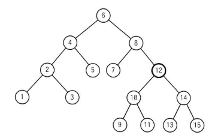

## 問題文

次の2分探索木から要素12を削除したとき，その位置に別の要素を移動するだけで2分探索木を再構成するには，削除された要素の位置にどの要素を移動すればよいか。

```
                  6
              /       \
             4         8
           /   \      / \
          2     5    7   12
         / \              |  \
        1   3            10   14
                         / \   / \
                        9  11 13  15
```

ア　9　　イ　10　　ウ　13　　エ　14

## 参照画像


<!-- 画像がある場合:  -->

## 正解

**ウ**：13

## 選択肢補足

| 選択肢 | 内容 | 補足 |
|:--|:--|:--|
| ア | 9 | 9は左部分木（10を根とする部分木）の最小値だが、9自身が左の子11を持たない葉ではあるものの、9を12の位置に移動すると、9の右側に10や11が来る関係が崩れ、2分探索木の大小関係（左部分木は全て小さい、右部分木は全て大きい）を保てなくなる |
| イ | 10 | 10は12の左部分木のルートで子（9と11）を2つ持つため、10だけを移動すると9と11の行き場がなくなり、「移動するだけ」では再構成できない |
| **ウ** | **13** | **正解。13は12の右部分木（14を根とする部分木）の最小値であり、かつ子を持たない葉ノードである。12より大きく14より小さいという大小関係をそのまま満たすため、13をそのまま12の位置に移動するだけで2分探索木の性質を保ったまま再構成できる** |
| エ | 14 | 14は12の右部分木のルートで子（13と15）を2つ持つため、14だけを移動すると13と15の行き場がなくなり、「移動するだけ」では再構成できない |

## 解き方

1. 問題文のキーワード・条件を整理する。
   - 削除対象は要素12で、子を2つ（左部分木のルート10、右部分木のルート14）持つノードである。
   - 「その位置に別の要素を移動するだけ」という制約があるため、移動後も2分探索木の性質（左部分木は全てそのノードより小さく、右部分木は全てそのノードより大きい）を保つ必要がある。
2. 2分探索木における「子を2つ持つノード」の削除の一般原則を確認する。
   - 削除対象ノードの位置には、左部分木の最大値（中間順序での先行ノード）または右部分木の最小値（中間順序での後続ノード）を移動させるのが標準的な方法である。
3. 12の左部分木・右部分木それぞれの最大値・最小値を特定する。
   - 左部分木（10を根とする{9, 10, 11}）の最大値は11。
   - 右部分木（14を根とする{13, 14, 15}）の最小値は13。
4. 選択肢にある9, 10, 13, 14のうち、上記の条件（最大値または最小値であり、かつ葉ノードであること）に当てはまるものを確認する。
   - 9は最小値ではあるが12の右側ではなく10の左の子であり、移動すると大小関係が崩れる。
   - 10と14はいずれもルートで子を2つ持つため、「移動するだけ」では済まない。
   - 13は右部分木の最小値であり、かつ子を持たない葉ノードであるため、そのまま移動できる。
5. 13を12の位置に移動した場合の木構造を検証する。
   - 13は10・11（左部分木）より大きく、14・15（右部分木）より小さいため、移動後も2分探索木の性質が保たれる。
6. 以上より、「移動するだけ」で2分探索木を再構成できる**ウ（13）**を正解と判断する。
