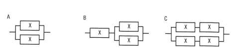

## 問題文

稼働率が等しい装置Xを直列や並列に組み合わせたとき，システム全体の稼働率を高い順に並べたものはどれか。ここで，装置Xの稼働率は0よりも大きく1未満である。

```
A：Xが2台、並列に接続された構成
B：Xが1台と、（Xが2台並列接続されたユニット）が直列に接続された構成
C：（Xが2台並列接続されたユニット）が2つ、直列に接続された構成
```

ア　A，B，C　　イ　A，C，B　　ウ　C，A，B　　エ　C，B，A

## 参照画像


<!-- 画像がある場合:  -->

## 正解

**イ**：A，C，B

## 選択肢補足

| 選択肢 | 内容 | 補足 |
|:--|:--|:--|
| ア | A，B，C | Bが3構成の中で最も低い稼働率になるため、Bを2番目に置くこの順序は誤り |
| **イ** | **A，C，B** | **正解。装置Xの稼働率をxとすると、A＝1－(1－x)²＝x(2－x)、B＝x×{1－(1－x)²}＝x²(2－x)、C＝{1－(1－x)²}²＝x²(2－x)²となる。0＜x＜1の範囲で常にA＞C＞Bが成立する** |
| ウ | C，A，B | Aが3構成の中で最も高い稼働率になるため、Aを2番目に置くこの順序は誤り |
| エ | C，B，A | A・Cの大小関係およびBの位置が実際の計算結果と逆になっており誤り |

## 解き方

1. 問題文・図の構成を整理する。
   - A：装置Xを2台、並列に接続しただけの構成（並列のみ）。
   - B：装置Xを1台と、装置X2台を並列接続したユニットとを、直列に接続した構成。
   - C：装置X2台を並列接続したユニットを2つ用意し、それらを直列に接続した構成。
2. 直列・並列接続の稼働率の公式を確認する。
   - 直列接続（両方とも稼働している必要がある）：稼働率の積。
   - 並列接続（どちらか一方が稼働していればよい）：1－(1－稼働率)の積。
3. 装置Xの稼働率をxとして、各構成の稼働率を数式で表す。
   - A＝1－(1－x)² ＝ x(2－x)
   - B＝x × {1－(1－x)²} ＝ x²(2－x)
   - C＝{1－(1－x)²}² ＝ x²(2－x)²
4. bash_toolによる計算検証（x=0.3, 0.5, 0.7, 0.9の各値で比較）を行い、いずれの場合もA＞C＞Bという大小関係が一貫して成立することを確認する。
5. 数式上でもA＝x(2－x)、C＝x²(2－x)²であり、0＜x＜1の範囲でA＞Cとなることを確認する（Aは並列のみでCより冗長性に劣る部分がない分、稼働率が高くなる）。同様にC＞Bとなることも確認する（Cは並列ユニットを2つ直列にしているのに対し、Bは並列ユニット1つと単体装置1台の直列であり、単体装置の分だけ脆弱性が増す）。
6. 計算結果と一致する「A，C，B」の順を示す**イ**を正解と判断する。
