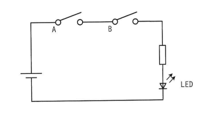
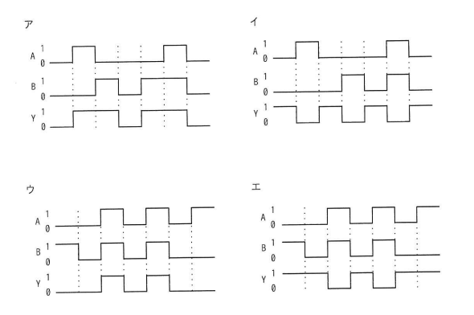

## 問題文

図はスイッチA及びBの状態によって，LEDが点灯又は消灯する回路である。スイッチAがオンの状態をA=1，オフの状態をA=0とし，スイッチBも同様にオンの状態をB=1，オフの状態をB=0とする。また，LEDが点灯する状態をY=1，消灯する状態をY=0とする。このとき，図の回路を動作させたときのタイミングチャートとして，適切なものはどれか。

```
回路図：電源 ── スイッチA ── スイッチB ── LED ── 電源（直列接続）
```

ア・イ・ウ・エ：A, B, Yの波形を示すタイミングチャート（4択）

## 参照画像



<!-- 画像がある場合:  -->

## 正解

**ウ**

## 選択肢補足

| 選択肢 | 内容 | 補足 |
|:--|:--|:--|
| ア | 波形パターン1 | YがAND条件（A=B=1のときのみY=1）と一致しないタイミングで点灯しており、回路の動作と矛盾する |
| イ | 波形パターン2 | スイッチがオフの状態でもYが1（点灯）になっている区間があり、AND条件と矛盾する |
| **ウ** | **波形パターン3** | **正解。AとBの両方が1（オン）になっている区間でのみYが1（点灯）になっており、それ以外の区間ではYが0（消灯）になっている。回路図の直列接続（AND条件）と完全に一致する** |
| エ | 波形パターン4 | スイッチがオフの状態でもYが1（点灯）になっている区間があり、AND条件と矛盾する |

## 解き方

1. 問題文・回路図の構成を整理する。
   - 電源からスイッチA、スイッチB、LEDへと直列に接続された回路である。
   - スイッチA・Bのオン状態を1、オフ状態を0、LEDの点灯状態をY=1、消灯状態をY=0とする。
2. 直列回路における通電条件を確認する。
   - 直列に接続されたスイッチは、すべてがオン（導通状態）にならない限り回路全体に電流が流れない。
   - したがって、この回路ではAとBの両方が1（オン）のときにのみ電流が流れ、LEDが点灯（Y=1）する。
3. 回路の論理関係を論理式で表す。
   - Y = A AND B（論理積）
   - 真理値表：A=0,B=0→Y=0／A=0,B=1→Y=0／A=1,B=0→Y=0／A=1,B=1→Y=1
4. 各選択肢のタイミングチャートを、上記のAND条件と照合する。
   - AとBの波形を見て、両方が1である区間を特定し、その区間でのみYが1になっているかを確認する。
   - AまたはBのどちらかが0である区間でYが1になっている選択肢は、AND回路の動作と矛盾するため誤り。
5. 選択肢ア・イ・エは、AとBの両方が1ではない区間でもYが1になっている部分があり、AND条件（直列回路の通電条件）と一致しないことを確認する。
6. AとBが共に1の区間でのみYが1となっている**ウ**が、回路の動作と完全に一致するため、正解と判断する。
