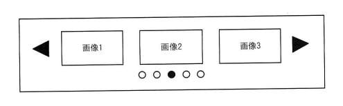

## 問題文

Webページの構成要素のうち，図のような固定の表示領域内でマウス操作やタッチ操作を行うことによってスクロールし，複数の画像などが横方向に順次表示されるものを何というか。

```
[固定の表示領域]
◀ [画像1] [画像2] [画像3] ▶
       ○ ○ ● ○ ○
```

ア　アコーディオン　　イ　カルーセル
ウ　タブ　　エ　モーダルウィンドウ

## 参照画像


<!-- 画像がある場合:  -->

## 正解

**イ**：カルーセル

## 選択肢補足

| 選択肢 | 内容 | 補足 |
|:--|:--|:--|
| ア | アコーディオン | 見出し部分をクリックやタップすることでコンテンツを展開・折りたたみできるUI要素で、主に縦方向に並んだ情報を省スペースで整理するために使われ、横方向の画像スライド表示ではない |
| **イ** | **カルーセル** | **正解。固定の表示領域内に複数の画像やコンテンツを配置し、利用者がマウス操作やタッチ操作（スワイプ、左右の矢印、インジケーターのクリックなど）によって横方向にスクロールし、一連のコンテンツを順次表示するUI要素である** |
| ウ | タブ | 上部などにある見出し部分をクリックすることで表示するコンテンツを切り替えるUI要素であり、本の索引タブを模したものでスクロールによる横方向の画像送りとは異なる |
| エ | モーダルウィンドウ | 画面上に重ねてポップアップ表示され、他の操作を一時的にブロックするウィンドウであり、固定領域内での横方向の画像送り表示とは異なる |

## 解き方

1. 問題文・図のキーワードを整理する。
   - 「固定の表示領域内」「マウス操作やタッチ操作によってスクロール」「複数の画像などが横方向に順次表示される」「左右の矢印（◀▶）やインジケーター（○●○）が示されている」という特徴を持つUI要素を選ぶ。
2. 各選択肢のUI要素の特徴を確認する。
   - アコーディオン：見出しのクリックでコンテンツを縦方向に展開・折りたたみする要素。
   - カルーセル：固定領域内で複数の画像・コンテンツを横方向にスライドさせながら順次表示する要素。スワイプや矢印ボタン、インジケーター（ドット）による操作が特徴。
   - タブ：見出し部分のクリックで表示内容を切り替える要素。
   - モーダルウィンドウ：他の操作をブロックして画面上に重ねて表示されるポップアップ要素。
3. 図に示された「左右の矢印」「複数の丸印（インジケーター）」「横方向に並んだ画像」という要素が、カルーセルの典型的な構成要素と一致することを確認する。
4. アコーディオン・タブ・モーダルウィンドウは、いずれも横方向のスクロールによる画像の順次表示という動作とは異なる仕組みであることを確認する。
5. 以上より、固定領域内でのスクロール操作による横方向の画像順次表示という動作と完全に一致する**イ（カルーセル）**を正解と判断する。
