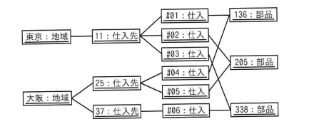
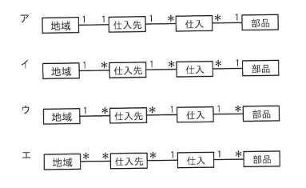

## 問題文

次のオブジェクト図（インスタンスを表す図）に対応する概念データモデルはどれか。ここで，オブジェクト図及び概念データモデルの表記にはUMLを用いる。

```
オブジェクト図（インスタンス）:
東京:地域 ── 11:仕入先 ── #01:仕入 ┐
                        ├ #02:仕入 ┼─ 136:部品
                        └ #03:仕入 ┘
大阪:地域 ── 25:仕入先 ── #04:仕入 ┐
            │            └ #05:仕入 ┼─ 205:部品
            └ 37:仕入先 ── #06:仕入 ┴─ 338:部品
```

ア　地域 1─1 仕入先 1─* 仕入 *─1 部品
イ　地域 1─* 仕入先 1─* 仕入 *─1 部品
ウ　地域 1─* 仕入先 *─1 仕入 1─* 部品
エ　地域 *─* 仕入先 *─1 仕入 1─* 部品

## 参照画像



<!-- 画像がある場合:  -->

## 正解

**イ**：地域 1─* 仕入先 1─* 仕入 *─1 部品

## 選択肢補足

| 選択肢 | 内容 | 補足 |
|:--|:--|:--|
| ア | 地域1-1仕入先 1-*仕入 *-1部品 | オブジェクト図では大阪という1つの地域インスタンスに25・37という2つの仕入先インスタンスが対応しており、「地域:仕入先＝1対1」ではなく「1対多」が正しいため、この部分が誤り |
| **イ** | **地域1-*仕入先 1-*仕入 *-1部品** | **正解。地域から見て1つの地域に複数の仕入先が存在し（1対多）、仕入先から見て1つの仕入先に複数の仕入が存在し（1対多）、仕入から見て複数の仕入が1つの部品に対応する（多対1）という、オブジェクト図のインスタンス間の対応関係を正しく表している** |
| ウ | 地域1-*仕入先 *-1仕入 1-*部品 | 仕入先と仕入の多重度が「多対1」、仕入と部品の多重度が「1対多」となっており、オブジェクト図で確認できる実際の対応関係（仕入先:仕入＝1対多、仕入:部品＝多対1）とは逆になっているため誤り |
| エ | 地域*-*仕入先 *-1仕入 1-*部品 | 地域と仕入先の関係が「多対多」となっているが、オブジェクト図では1つの仕入先（11、25、37）はそれぞれ1つの地域（東京または大阪）にのみ属しており、「多対多」ではなく「1対多」が正しいため誤り |

## 解き方

1. 問題文・オブジェクト図の構成を整理する。
   - 地域インスタンス：東京、大阪（2件）
   - 仕入先インスタンス：11（東京に属する）、25・37（大阪に属する）（3件）
   - 仕入インスタンス：#01〜#06（6件）
   - 部品インスタンス：136、205、338（3件）
2. オブジェクト図は具体的なインスタンス間の関連を示したものであり、これに対応する概念データモデル（クラス図）の多重度を、各インスタンスの対応関係の数から読み取る。
3. 「地域」と「仕入先」の多重度を確認する。
   - 東京には仕入先11が1件、大阪には仕入先25・37の2件が対応している。
   - 1つの地域インスタンスに1つ以上の仕入先インスタンスが関連付けられているため、地域：仕入先の多重度は「1対多」である。
4. 「仕入先」と「仕入」の多重度を確認する。
   - 仕入先11には仕入#01〜#03の3件、仕入先25には#04・#05の2件、仕入先37には#06の1件が対応している。
   - 1つの仕入先インスタンスに1つ以上の仕入インスタンスが関連付けられているため、仕入先：仕入の多重度は「1対多」である。
5. 「仕入」と「部品」の多重度を確認する。
   - オブジェクト図上で、複数の仕入インスタンスが1つの部品インスタンスに集約されるように接続されている（1つの部品が複数の仕入によって調達されている）。
   - したがって、仕入：部品の多重度は「多対1」である。
6. 上記3つの多重度（地域:仕入先＝1対多、仕入先:仕入＝1対多、仕入:部品＝多対1）と各選択肢を照合する。
   - ア・エは地域と仕入先の多重度が誤り（1対1、多対多）。
   - ウは仕入先と仕入、仕入と部品の多重度が逆になっている。
   - イのみが3つの多重度すべてと一致する。
7. 以上より、**イ**を正解と判断する。
