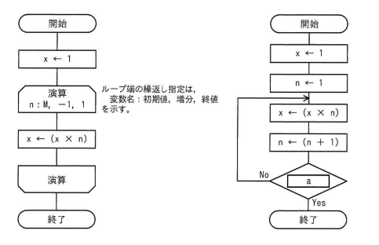

## 問題文

正の整数Mに対して，次の二つの流れ図に示すアルゴリズムを実行したとき，結果xの値が等しくなるようにしたい。aに入れる条件として，適切なものはどれか。

【左の流れ図】
```
開始
x ← 1
[演算] n: M, -1, 1 （ループ端の繰り返し指定は、変数名：初期値、増分、終値を示す）
  x ← (x × n)
[演算終わり]
終了
```

【右の流れ図】
```
開始
x ← 1
n ← 1
↓
x ← (x × n)
n ← (n + 1)
[ a ] --No-→ （x←(x×n)へ戻る）
  ↓ Yes
終了
```

ア　n＜M　　イ　n＞M－1　　ウ　n＞M　　エ　n＞M＋1

## 参照画像



## 正解

**ウ**：n＞M

## 選択肢補足

| 選択肢 | 内容 | 補足 |
|:--|:--|:--|
| ア | n＜M | nは1から増加していく変数のため、この条件ではnがMより小さい限りループが終了せず、Mの値によっては無限ループまたは意図しない回数の繰り返しになる |
| イ | n＞M－1 | M=2のときn=2で条件を満たして終了してしまい、x=1のままでM!（=2）が計算できないなど、Mによって正しい結果にならない |
| **ウ** | **n＞M** | **正解。nがMに達するまで x←x×n を繰り返し、n=M+1になった時点でループを抜けるため、ちょうどM!（1×2×…×M）が得られる** |
| エ | n＞M＋1 | n=M+1の時点でも条件を満たさずループが1回余分に実行され、x=(M+1)!となってM!より大きい値になってしまう |

## 解き方

1. 左の流れ図の処理内容を確認する。
   - x=1から始めて、nをMから1まで1ずつ減らしながらx←x×nを繰り返す。これはM×(M-1)×…×1、すなわちM!（Mの階乗）を計算する処理である。
2. 右の流れ図の処理内容を確認する。
   - x=1, n=1から始めて、x←x×n、n←n+1を行った後に条件aを判定し、aが偽（No）ならループを継続、真（Yes）なら終了する、という構造になっている。
3. 右の流れ図がM!を出力するために必要な条件を考える。
   - n=1,2,…,Mまでをxに掛け合わせ、n=M+1になった時点でループを終了させる必要がある。
4. bash_toolで複数のMの値（1〜5）について実際にシミュレーションし、各選択肢の条件で右の流れ図がM!と一致するか網羅的に検証する。
   - ア（n<M）はM=1のとき無限ループとなり不適切。
   - イ（n>M-1）はM=2のときx=1（2!=2と不一致）など、複数のMで不一致。
   - ウ（n>M）はM=1〜5の全てでM!と完全に一致した。
   - エ（n>M+1）は1回多くx×nが実行され、M!より大きい(M+1)!相当の値になり不一致。
5. 全てのMの値で左右の流れ図の結果が一致する条件は**ウ（n＞M）**のみであることを計算検証から確認し、これを正解と判断する。
