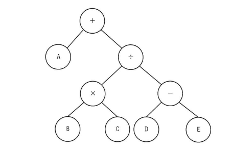

## 問題文

各ノードがもつデータを出力する再帰処理 f(ノードn) を定義した。この処理を，図の2分木の根（最上位のノード）から始めたときの出力はどれか。

〔f(ノードn)の定義〕

1. ノードnの右に子ノードrがあれば，f(ノードr)を実行
2. ノードnの左に子ノードlがあれば，f(ノードl)を実行
3. 再帰処理 f(ノードr)，f(ノードl) を未実行の子ノード，又は子ノードがなければ，ノード自身がもつデータを出力
4. 終了

【2分木の構造】

```
            +
          /   \
         A     ÷
             /    \
            ×      -
          /  \    /  \
         B    C  D    E
```

ア　＋÷－ED×CBA
イ　ABC×DE－÷＋
ウ　E－D÷C×B＋A
エ　ED－CB×÷A＋

## 参照画像



## 正解

**エ**：ED－CB×÷A＋

## 選択肢補足

| 選択肢 | 内容 | 補足 |
|:--|:--|:--|
| ア | ＋÷－ED×CBA | 根を最初に出力する前行順（先行順）の並びに近く、定義の「右→左→中（自身）」の出力順序と一致しない |
| イ | ABC×DE－÷＋ | 左の子から先に処理する順（左→右→中）に相当し、定義にある「右の子を先に実行」という手順と一致しない |
| ウ | E－D÷C×B＋A | EとDの出力順序や全体の並びが、右→左→中で実際に辿った場合の正しい順序と一致しない |
| **エ** | **ED－CB×÷A＋** | **正解。根「＋」から右の子「÷」→さらに右の子「－」→さらに右の子「E」（子なしのため出力）→左の子「D」（出力）→「－」自身を出力→「÷」の左の子「×」→「C」出力→「B」出力→「×」自身を出力→「÷」自身を出力→根「＋」の左の子「A」を出力→最後に根「＋」自身を出力、という順にbash_toolでのシミュレーションでも完全に一致する** |

## 解き方

1. f(ノードn)の処理順序を整理する。
   - 定義の1→2→3の流れから、あるノードに対して「右の子を先に再帰処理」→「左の子を再帰処理」→「子がなくなった時点（または両方の再帰処理が終わった時点）で自身を出力」という順序になる。これは「右→左→中（自身）」の順に走査する後行順（postorder）探索の一種である。
2. 木構造を整理する。
   - 根：＋（右の子：÷、左の子：A）
   - ÷（右の子：－、左の子：×）
   - －（右の子：E、左の子：D）
   - ×（右の子：C、左の子：B）
3. bash_toolでPythonによる再帰処理を実装し、根「＋」から実際にトレースする。
   - f(+) → f(÷) → f(-) → f(E)（子なし→出力E）→ f(D)（子なし→出力D）→「-」自身を出力 → f(×) → f(C)（出力C）→ f(B)（出力B）→「×」自身を出力 →「÷」自身を出力 → f(A)（子なし→出力A）→「+」自身を出力。
4. 出力結果を結合する。
   - シミュレーション結果は E, D, -, C, B, ×, ÷, A, + の順となり、文字列にすると「ED－CB×÷A＋」となる。
5. 各選択肢と照合する。
   - 計算で得られた出力順序「ED－CB×÷A＋」と完全に一致するのはエのみである。
6. 以上より、実際のトレース（計算検証）に基づき**エ**を正解と判断する。
