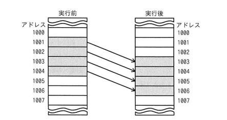

## 問題文

同一メモリ空間で，転送元の開始アドレス，転送先の開始アドレス，方向フラグ及び転送語数をパラメータとして指定することによって，データをブロック転送できる機能をもつ CPU がある。図のようにアドレス 1001 から 1004 のデータをアドレス 1003 から 1006 に転送するとき，指定するパラメータとして適切なものはどれか。ここで，転送は開始アドレスから 1 語ずつ行われ，方向フラグに 0 を指定するとアドレスの昇順に，1 を指定するとアドレスの降順に転送を行うものとする。

| | 転送元の開始アドレス | 転送先の開始アドレス | 方向フラグ | 転送語数 |
|:--|:--:|:--:|:--:|:--:|
| ア | 1001 | 1003 | 0 | 4 |
| イ | 1001 | 1003 | 1 | 4 |
| ウ | 1004 | 1006 | 0 | 4 |
| エ | 1004 | 1006 | 1 | 4 |

## 参照画像

## 正解

**エ**：転送元の開始アドレス1004，転送先の開始アドレス1006，方向フラグ1，転送語数4

## 選択肢補足

| 選択肢 | 内容 | 補足 |
|:--|:--|:--|
| ア | 1001／1003／方向0（昇順）／4語 | 昇順（1001→1002→1003→1004の順）で転送すると、1003番地への書き込みが先に行われてしまい、その後本来1003番地から読むはずだったデータが上書き後の値になってしまう（上書き事故）。bash_toolによるin-placeシミュレーションでも1005,1006番地の結果が誤りになることを確認 |
| イ | 1001／1003／方向1（降順）／4語 | 開始アドレスが1001のままで降順に転送すると、転送元アドレスが1001→1000→999→998と範囲外に進んでしまい、意図したアドレス1001〜1004のデータを正しく転送できない |
| ウ | 1004／1006／方向0（昇順）／4語 | 転送先の開始アドレスは正しいが、昇順で進めると転送元アドレスが1004→1005→1006→1007と本来の範囲を超えて進んでしまい、正しいデータを転送できない |
| **エ** | **1004／1006／方向1（降順）／4語** | **正解。転送元の末尾（1004）と転送先の末尾（1006）から開始し、降順（1004→1003→1002→1001）に1語ずつ転送することで、未読みのデータを上書きする前に読み出すことができ、bash_toolでのin-placeシミュレーションでも正しい最終結果（1003←a, 1004←b, 1005←c, 1006←d）が得られることを確認** |

## 解き方

1. 転送元・転送先のアドレス範囲を整理する。
   - 転送元：1001〜1004番地のデータを、転送先：1003〜1006番地に移動する。両者のアドレス範囲が1003・1004で重なっている（オーバーラップ）点に注意が必要である。
2. オーバーラップする転送における注意点を確認する。
   - 転送元と転送先のアドレス範囲が重なる場合、転送順序を誤ると、まだ読み出していない元データを先に上書きしてしまう「データ破壊」が起こり得る。
3. bash_toolで各選択肢のパラメータをin-place（同一メモリ空間内）でシミュレーションし、実際にどのアドレスにどの値が書き込まれるかを1ステップずつ検証する。
   - ア（昇順）：1001→1003転送後、1003→1005の転送時には既に1003番地が書き換わっており、誤った値が転送されることを確認。
   - イ：転送元アドレスが範囲外（1000未満）に進んでしまい、正しいデータが得られないことを確認。
   - ウ：転送元アドレスが範囲を超えて進み、誤った値が転送されることを確認。
   - エ（降順、転送元1004・転送先1006から開始）：1004→1006、1003→1005、1002→1004、1001→1003の順に転送され、全てのステップで上書き前のデータを正しく読み出せることを確認。
4. 正しい転送順序の理由を整理する。
   - 転送先のアドレスが転送元より大きい（後ろにずれる）ため、末尾（大きいアドレス）から先に転送し、徐々に若いアドレスへ進める（降順）ことで、上書きされる前に必要なデータを読み出せる。
5. 最終結果を確認する。
   - bash_toolでのシミュレーション結果より、エのパラメータのみが意図した転送結果（1003←1001の値，1004←1002の値，1005←1003の値，1006←1004の値）と完全に一致した。
6. 以上の計算検証から、転送元1004・転送先1006・方向フラグ1（降順）・転送語数4である**エ**を正解と判断する。
