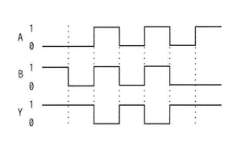
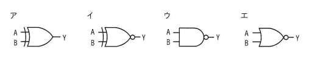

## 問題文

入力がAとB，出力がYの論理回路を動作させたとき，図のタイムチャートが得られた。この論理回路として，適切なものはどれか。

【タイムチャート】

A，B，Yはそれぞれ0または1の値を時間経過とともに取り、図中の各区間における（A，B，Y）の組合せは次のようになっている：①（0，1，1）、②（0，0，1）、③（1，1，0）、④（0，0，1）、⑤（1，1，0）、⑥（0，0，1）、⑦（1，0，1）

これらを重複を除いて整理すると、以下の真理値表が得られる。

| A | B | Y |
|:-:|:-:|:-:|
| 0 | 0 | 1 |
| 0 | 1 | 1 |
| 1 | 0 | 1 |
| 1 | 1 | 0 |

ア　（OR形状の記号、出力に丸なし）
イ　（OR形状の記号、出力に丸あり：NOR）
ウ　（AND形状の記号、出力に丸あり：NAND）
エ　（OR形状の記号、出力に丸あり：NOR、ただし入力線の形状が異なるもの）

## 参照画像

<!-- 画像がある場合:  -->

## 正解

**ウ**：NAND（否定論理積）回路

## 選択肢補足

| 選択肢 | 内容 | 補足 |
|:--|:--|:--|
| ア | OR（論理和）の回路記号 | ORはA,Bのいずれかが1なら出力1、両方0のときだけ出力0となり、真理値表（A=0,B=0でY=1）と矛盾するため不適切 |
| イ | NOR（否定論理和）相当の回路記号 | NORはA,Bが両方0のときだけ1を出力し、それ以外は0を出力する。真理値表のA=1,B=0でY=1という結果と矛盾するため不適切 |
| **ウ** | **NAND（否定論理積）の回路記号** | **正解。AND形状の素子に出力側の否定（小さな丸）が付いた記号であり、A,Bが共に1のときだけ0を出力し、それ以外（少なくとも一方が0）のときは1を出力するNANDの真理値表と完全に一致する** |
| エ | NOR相当の別形状の回路記号 | イと同様にNOR系の動作を示す記号であり、A=1,B=0でY=1という条件を満たせないため不適切 |

## 解き方

1. タイムチャートからA・B・Yの各時点での値を読み取る。
   - 図中の複数の区間について、A・B・Yの組合せを順に読み取ると、(0,1,1)、(0,0,1)、(1,1,0)、(0,0,1)、(1,1,0)、(0,0,1)、(1,0,1) というデータが得られる。
2. 重複を除いて入力の組合せごとに出力をまとめる。
   - (A,B)=(0,0) のとき Y=1
   - (A,B)=(0,1) のとき Y=1
   - (A,B)=(1,0) のとき Y=1
   - (A,B)=(1,1) のとき Y=0
3. この真理値表がどの論理演算に対応するかを確認する。
   - 「A,Bが共に1のときだけ0を出力し、それ以外はすべて1を出力する」というパターンは、AND（論理積）の結果を反転させたNAND（否定論理積）の定義と一致する。
4. bash_toolで主要な論理演算（AND, OR, NAND, NOR, XOR）の真理値表を計算し、読み取った真理値表と照合する。
   - AND: (0,0)→0, (0,1)→0, (1,0)→0, (1,1)→1 → 不一致
   - OR: (0,0)→0, (0,1)→1, (1,0)→1, (1,1)→1 → 不一致
   - NOR: (0,0)→1, (0,1)→0, (1,0)→0, (1,1)→0 → 不一致
   - XOR: (0,0)→0, (0,1)→1, (1,0)→1, (1,1)→0 → 不一致
   - NAND: (0,0)→1, (0,1)→1, (1,0)→1, (1,1)→0 → 完全一致
5. 回路記号の形状を確認する。
   - AND素子（直線の入力側と丸みを帯びた出力側）の出力に否定を表す小さな丸が付いている記号がNANDを表す。
6. 以上より、真理値表の読み取りと論理演算の照合の両面から、NANDの回路記号である**ウ**を正解と判断する。
