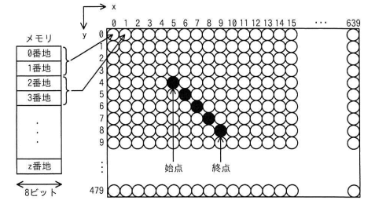

## 問題文

次の方式で画素にメモリを割り当てる640×480のグラフィックLCDモジュールがある。始点(5, 4)から終点(9, 8)まで直線を描画するとき，直線上のx=7の画素に割り当てられたメモリのアドレスの先頭は何番地か。ここで，画素の座標は(x, y)で表すものとする。

〔方式〕

- メモリは0番地から昇順に使用する。
- 1画素は16ビットとする。
- 座標(0, 0)から座標(639, 479)までメモリを連続して割り当てる。
- 各画素は，x=0からx軸の方向にメモリを割り当てていく。
- x=639の次はx=0とし，yを1増やす。

ア　3847　　イ　7680　　ウ　7694　　エ　8978

## 参照画像

## 正解

**ウ**：7694

## 選択肢補足

| 選択肢 | 内容 | 補足 |
|:--|:--|:--|
| ア | 3847 | 画素の通し番号（3848番目）をそのままアドレスとして扱うなど、「1画素=2番地」の換算（×2）を行わなかった場合に近い値 |
| イ | 7680 | y座標の計算や画素番号の数え方を誤った場合に生じやすい値 |
| **ウ** | **7694** | **正解。座標(7,6)が通し番号3848番目の画素であり、(3848－1)×2＝7694番地となる（bash_toolでの計算でも一致）** |
| エ | 8978 | x,yの取り違えなど、画素位置の特定を誤った場合に生じやすい値 |

## 解き方

1. 始点(5,4)から終点(9,8)までの直線上で、x=7のときのy座標を求める。
   - dx＝9－5＝4、dy＝8－4＝4 で傾きが1の直線（dx=dyの45度の直線）であるため、x=7のとき（始点から2ステップ進んだ位置）、y＝4＋2＝6となる。bash_toolでの比例計算でも y=6.0 と確認した。
2. 求めた画素の座標(7, 6)が、メモリ割当て順で何番目の画素にあたるかを求める。
   - 各行には640画素（x=0〜639）があり、y=0からy=6まで、すなわち6行分（y=0〜5）がすべて埋まった後、7行目（y=6）のx=7番目（0始まりで8番目）の画素となる。
   - 通し番号＝640×6＋(7＋1)＝3840＋8＝3848番目（1番目をx=0,y=0とする1始まりの通し番号）。
3. 画素の通し番号からメモリアドレスの先頭番地を求める。
   - 1画素は16ビット＝2番地分（メモリの1番地が8ビットのため）であるため、n番目の画素のアドレス先頭は (n－1)×2 という式で表される。
4. bash_toolで実際に計算する。
   - 通し番号3848番目の画素のアドレス先頭＝(3848－1)×2＝3847×2＝7694番地となることを確認した。
5. 計算結果と選択肢を照合する。
   - 計算で得られた7694番地と一致するのはウのみである。
6. 以上の座標計算とメモリアドレス換算の計算検証から、**ウ**を正解と判断する。
