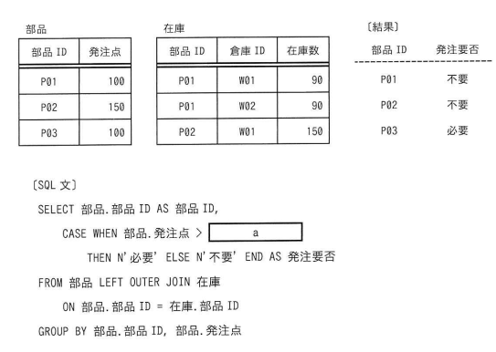

## 問題文

"部品"表及び"在庫"表に対し，SQL文を実行して結果を得た。SQL文のaに入れる字句はどれか。

【部品】

| 部品ID | 発注点 |
|:--:|:--:|
| P01 | 100 |
| P02 | 150 |
| P03 | 100 |

【在庫】

| 部品ID | 倉庫ID | 在庫数 |
|:--:|:--:|:--:|
| P01 | W01 | 90 |
| P01 | W02 | 90 |
| P02 | W01 | 150 |

【結果】

| 部品ID | 発注要否 |
|:--:|:--:|
| P01 | 不要 |
| P02 | 不要 |
| P03 | 必要 |

〔SQL文〕

```sql
SELECT 部品.部品ID AS 部品ID,
    CASE WHEN 部品.発注点 > [ a ]
        THEN N'必要' ELSE N'不要' END AS 発注要否
FROM 部品 LEFT OUTER JOIN 在庫
    ON 部品.部品ID = 在庫.部品ID
GROUP BY 部品.部品ID, 部品.発注点
```

ア　COALESCE(MIN(在庫.在庫数), 0)
イ　COALESCE(MIN(在庫.在庫数), NULL)
ウ　COALESCE(SUM(在庫.在庫数), 0)
エ　COALESCE(SUM(在庫.在庫数), NULL)

## 参照画像



## 正解

**ウ**：COALESCE(SUM(在庫.在庫数), 0)

## 選択肢補足

| 選択肢 | 内容 | 補足 |
|:--|:--|:--|
| ア | COALESCE(MIN(在庫.在庫数), 0) | MIN関数を使うとP01の在庫数の最小値90に対し発注点100が上回るため「必要」と判定されてしまい、〔結果〕のP01「不要」と矛盾する（bash_toolによるSQLite実行検証でも不一致を確認） |
| イ | COALESCE(MIN(在庫.在庫数), NULL) | アと同様にMIN関数による値の誤りに加え、第2引数がNULLのためP03（在庫データなし）の比較がNULLとの比較となり常にUNKNOWN（不要側）となり、〔結果〕のP03「必要」と矛盾する（実行検証でも不一致を確認） |
| **ウ** | **COALESCE(SUM(在庫.在庫数), 0)** | **正解。SUM関数でP01の在庫合計90+90=180を発注点100と比較すると「不要」、P02は150=150で「不要」、P03は在庫データなし（NULL）がCOALESCEにより0に変換され発注点100>0で「必要」となり、〔結果〕と完全に一致する（bash_toolでのSQLite実行検証で確認済み）** |
| エ | COALESCE(SUM(在庫.在庫数), NULL) | SUM関数自体はウと同じ値を返すが、第2引数がNULLのためP03の比較がNULLとの比較となり常にUNKNOWN（不要側）となってしまい、〔結果〕のP03「必要」と矛盾する（実行検証でも不一致を確認） |

## 解き方

1. SQL文の全体構造を確認する。
   - 部品表と在庫表を部品IDで左外部結合（LEFT OUTER JOIN）し、部品ID・発注点ごとにグループ化したうえで、発注点と在庫数の集計値を比較してCASE式で「必要」「不要」を判定している。
2. 左外部結合の結果、在庫データを持たない部品（P03）の在庫数列がNULLになる点に着目する。
   - 集計関数（SUM・MIN）にNULLを含む行を渡すと、対象データが存在しない部品では集計結果自体もNULLになり得るため、COALESCE関数でNULLを0に変換する必要がある。
3. 各部品について、SUM（合計）とMIN（最小値）のどちらが〔結果〕と整合するかを検証する。
   - P01：在庫数90・90 → SUM=180、MIN=90。発注点100との比較で、SUM(180>100は偽→不要)、MIN(90>100は真→必要)。〔結果〕は「不要」なのでSUMが正しい。
4. bash_toolでSQLite上に部品表・在庫表を再現し、4つの選択肢のSQL文を実際に実行して〔結果〕と比較する。
   - ア（MIN, 0）：P01が「必要」となり不一致。
   - イ（MIN, NULL）：P01が「必要」、P03が「不要」となり不一致。
   - ウ（SUM, 0）：P01「不要」、P02「不要」、P03「必要」となり〔結果〕と完全一致。
   - エ（SUM, NULL）：P03が「不要」になってしまい不一致。
5. COALESCEの第2引数（NULL代替値）の役割を確認する。
   - 第2引数を0にすることで、在庫データが存在しない部品（P03）の在庫合計が0として扱われ、発注点100>0が成立し「必要」と正しく判定される。NULLのままだと比較自体がUNKNOWNとなり「不要」側に倒れてしまう。
6. 以上の実行検証から、SUM関数とCOALESCEの第2引数0の組合せである**ウ**を正解と判断する。
