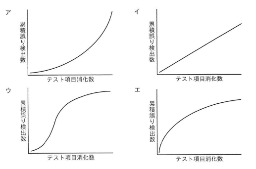

## 問題文

ソフトウェア信頼度成長モデルの一つであって，テスト工程においてバグが収束したと判定する根拠の一つとして使用するゴンペルツ曲線はどれか。

【選択肢のグラフ（横軸：テスト項目消化数、縦軸：累積誤り検出数）】

ア　テスト項目消化数の増加とともに、累積誤り検出数が下に凸の形で加速度的に増加し続けるグラフ（指数関数的な右肩上がりの曲線）
イ　テスト項目消化数の増加に対して、累積誤り検出数がほぼ一定の傾きで直線的に増加するグラフ
ウ　テスト項目消化数の増加とともに、累積誤り検出数が緩やかに増加し始め、中盤で急激に増加し、その後再び緩やかになり上限に収束していくS字形のグラフ
エ　テスト項目消化数の増加に対して、累積誤り検出数が初期に急激に増加した後、徐々に伸びが鈍化しながら上に凸の形で収束していくグラフ

## 参照画像

<!-- 画像がある場合:  -->

## 正解

**ウ**：テスト項目消化数の増加とともに、累積誤り検出数が緩やかに増加し始め、中盤で急激に増加し、その後再び緩やかになり上限に収束していくS字形のグラフ

## 選択肢補足

| 選択肢 | 内容 | 補足 |
|:--|:--|:--|
| ア | 下に凸の加速度的増加曲線 | テストが進むほどバグ検出数の増加ペースが上がり続ける形状であり、バグの収束（発見ペースの鈍化）を示しておらず、ゴンペルツ曲線の「収束」という特徴と矛盾する |
| イ | ほぼ直線的な増加グラフ | テスト項目消化数に比例して一定のペースでバグが見つかり続ける形状であり、テスト終盤でも収束する様子が見られないため、バグ収束の判定根拠としては不適切で、ゴンペルツ曲線の特徴であるS字とは異なる |
| **ウ** | **緩やか→急増→緩やかに収束するS字曲線** | **正解。ゴンペルツ曲線（信頼度成長曲線）は、テスト初期は摘出されるバグが少なく、テスト中盤にかけて急激にバグの摘出数が増加し、テスト後半に近づくにつれて摘出ペースが鈍化し、累積誤り検出数が上限値に収束していくというS字型の確率モデルを表す。このS字の収束する形状が、テスト工程でバグが出尽くした（収束した）と判定する根拠として用いられる** |
| エ | 初期急増後に上に凸で収束するグラフ | バグの検出ペースがテスト開始直後から急激に高く、その後鈍化していく形状であり、テスト初期の立ち上がりが緩やかであるべきというゴンペルツ曲線本来のS字の特徴（初期は緩やかに増加し始める）とは異なる |

## 解き方

1. 問題文のキーワードを整理する。
   - 「ソフトウェア信頼度成長モデルの一つであり、テスト工程でバグが収束したと判定する根拠として使用するゴンペルツ曲線」のグラフを選ぶ問題である。
2. ゴンペルツ曲線（信頼度成長曲線）の基本的な特徴を確認する。
   - ゴンペルツ曲線は、テストの進行（テスト項目消化数）に対する累積バグ（誤り）検出数の推移を表すS字型の確率モデルであり、テスト初期は摘出数が少なく、中盤にかけて急激に増加し、後半は再び緩やかになって一定の上限値に収束していくという形状を持つ。
3. この特徴がバグ収束判定の根拠となる理由を確認する。
   - テスト後半でグラフの傾きが緩やかになり、累積誤り検出数が頭打ち（収束）する様子が観測されることで、「これ以上テストを続けても新たなバグの発見数は大きく増えない＝バグが収束した」と判断する材料として使われる。
4. 各グラフの形状とゴンペルツ曲線の特徴を照合する。
   - 加速度的に増加し続けるグラフ（下に凸）は収束する様子がなく不適切。
   - 直線的に増加するグラフも収束を示さず不適切。
   - 初期から急増し上に凸で収束するグラフは、テスト初期の緩やかな立ち上がりというS字特有の前半部分の形状を欠いており不適切。
   - 緩やか→急増→再び緩やかになり収束するS字形のグラフのみが、ゴンペルツ曲線の典型的な形状と一致する。
5. S字曲線の意味を再確認する。
   - このS字の形状は、テスト開始直後は不具合の発見に時間がかかり、テストが軌道に乗ると効率的に多くのバグが見つかるようになり、最終的にはバグが出尽くして発見ペースが落ち着くという、現実のテストプロセスの推移をモデル化したものである。
6. 以上より、緩やかな立ち上がり・急増・収束というS字形のグラフである**ウ**を正解と判断する。
