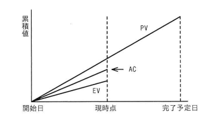

## 問題文

EVMで管理しているプロジェクトがある。図は，プロジェクトの開始から完了予定までの期間の半分が経過した時点での状況である。コスト効率，スケジュール効率がこのままで推移すると仮定した場合の見通しのうち，適切なものはどれか。

【グラフ】（横軸：時間（開始日〜現時点〜完了予定日）、縦軸：累積値）

- PV（計画値）：開始日から完了予定日まで直線的に増加する線
- AC（実コスト）：現時点でPVよりやや低い位置にある線
- EV（出来高）：現時点でACよりさらに低い位置にある線

つまり、現時点で **EV ＜ AC ＜ PV** という関係になっている。

ア　計画に比べてコストは多くなり，プロジェクトの完了は遅くなる。
イ　計画に比べてコストは多くなり，プロジェクトの完了は早くなる。
ウ　計画に比べてコストは少なくなり，プロジェクトの完了は遅くなる。
エ　計画に比べてコストは少なくなり，プロジェクトの完了は早くなる。

## 参照画像

## 正解

**ア**：計画に比べてコストは多くなり，プロジェクトの完了は遅くなる。

## 選択肢補足

| 選択肢 | 内容 | 補足 |
|:--|:--|:--|
| **ア** | **コストは多くなり，完了は遅くなる** | **正解。図よりEV＜AC（出来高より実コストが大きい）であるためコスト効率指数CPI＝EV／AC＜1となり、このまま推移すると計画よりコストが多くかかる。また、EV＜PV（出来高が計画値より少ない）であるためスケジュール効率指数SPI＝EV／PV＜1となり、計画よりスケジュールが遅れている。bash_toolによる指標計算でもCPI<1・SPI<1の両方が確認された** |
| イ | コストは多くなり，完了は早くなる | コストが多くなる点はEV＜ACから正しく導けるが、EV＜PVによりスケジュールは遅れている（SPI<1）ため、「完了が早くなる」という結論は図の状況と矛盾する |
| ウ | コストは少なくなり，完了は遅くなる | スケジュールが遅れる点はEV＜PVから正しく導けるが、EV＜ACによりコストは少なくなるのではなく多くなる（CPI<1）ため、「コストは少なくなる」という結論は図の状況と矛盾する |
| エ | コストは少なくなり，完了は早くなる | EV＜AC・EV＜PVのいずれの関係からも、コストの増加・スケジュールの遅延が読み取れるため、両方とも図の状況と矛盾する |

## 解き方

1. グラフから読み取れる現時点での3指標の大小関係を確認する。
   - 図の現時点（期間の半分が経過した時点）において、PV（計画値）＞AC（実コスト）＞EV（出来高）という順序になっている。
2. コスト効率（CPI：Cost Performance Index）を確認する。
   - CPI＝EV／ACで計算され、1より大きければコスト効率が良い（計画よりコストが少ない）、1より小さければコスト効率が悪い（計画よりコストが多い）ことを示す。
   - 図ではEV＜ACであるため、CPI＝EV／AC＜1となり、このまま推移すると完成時の総コストは計画（予算）より多くなると見込まれる。
3. スケジュール効率（SPI：Schedule Performance Index）を確認する。
   - SPI＝EV／PVで計算され、1より大きければ進捗が計画より早い、1より小さければ進捗が計画より遅いことを示す。
   - 図ではEV＜PVであるため、SPI＝EV／PV＜1となり、このまま推移するとプロジェクトの完了は計画（予定）より遅くなると見込まれる。
4. bash_toolで、EV<AC<PVという関係から両指標（CPI、SPI）がともに1未満になることを確認した。
5. 両指標の意味を統合する。
   - CPI<1：同じ出来高（完了した作業量）に対して、計画より多くのコストがかかっている＝コスト超過の見通し。
   - SPI<1：計画された進捗（PV）に対して、実際の進捗（EV）が遅れている＝スケジュール遅延の見通し。
6. 以上より、コストは計画より多くなり、プロジェクトの完了は計画より遅くなるという見通しを示す**ア**を正解と判断する。
