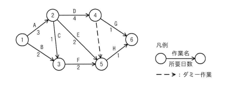

## 問題文

図のアローダイアグラムで表されるプロジェクトがある。結合点5の最早結合点時刻はプロジェクトの開始から第何日か。ここで，プロジェクトの開始日は0日目とする。

【アローダイアグラムの構造】

- 結合点1 → 結合点2：作業A（3日）
- 結合点1 → 結合点3：作業B（2日）
- 結合点2 → 結合点3：作業C（1日）
- 結合点2 → 結合点4：作業D（4日）
- 結合点2 → 結合点5：作業E（2日）
- 結合点3 → 結合点5：作業F（2日）
- 結合点4 → 結合点6：作業G（1日）
- 結合点4 → 結合点5：ダミー作業（所要日数0）
- 結合点5 → 結合点6：作業H（1日）

ア　4　　イ　5　　ウ　6　　エ　7

## 参照画像

## 正解

**エ**：7

## 選択肢補足

| 選択肢 | 内容 | 補足 |
|:--|:--|:--|
| ア | 4 | 結合点5に至る経路のうち、A→E経路（3+2=5日）など一部の経路のみで計算した場合に近い、過小評価した値 |
| イ | 5 | A→E経路の所要日数（3+2=5日）をそのまま結合点5の最早結合点時刻とした場合に生じやすい誤り（他の経路を考慮していない） |
| ウ | 6 | B→F経路（2+2=4日）やA→C→F経路（3+1+2=6日）など、一部の経路のみで計算した場合に生じやすい値（A→D→ダミー経路を見落とした場合） |
| **エ** | **7** | **正解。結合点5に至る全ての経路（A→E：5日、B→F：4日、A→C→F：6日、A→D→ダミー：7日）のうち最も時間のかかる経路がA→D→ダミーの7日であり、bash_toolによる計算でも結合点5の最早結合点時刻は7と確認された** |

## 解き方

1. 結合点5に至る全ての経路（先行作業の組合せ）を洗い出す。
   - 経路1：結合点1→結合点2（A：3日）→結合点5（E：2日）＝3+2＝5日
   - 経路2：結合点1→結合点3（B：2日）→結合点5（F：2日）＝2+2＝4日
   - 経路3：結合点1→結合点2（A：3日）→結合点3（C：1日）→結合点5（F：2日）＝3+1+2＝6日
   - 経路4：結合点1→結合点2（A：3日）→結合点4（D：4日）→結合点5（ダミー：0日）＝3+4+0＝7日
2. 最早結合点時刻の定義を確認する。
   - ある結合点に到達するためには、その結合点に入る全ての作業（経路）が完了している必要があるため、最早結合点時刻は、その結合点に至る全経路のうち最も時間のかかる経路の所要日数で決まる。
3. bash_toolで各結合点の最早結合点時刻を順次計算する。
   - EST[1]＝0
   - EST[2]＝EST[1]+A＝0+3＝3
   - EST[3]＝max(EST[1]+B, EST[2]+C)＝max(0+2, 3+1)＝4
   - EST[4]＝EST[2]+D＝3+4＝7
   - EST[5]＝max(EST[2]+E, EST[3]+F, EST[4]+ダミー(0))＝max(3+2, 4+2, 7+0)＝max(5,6,7)＝7
4. 計算結果を確認する。
   - 結合点5に至る経路の中で最も時間のかかるのは、結合点4（最早結合点時刻7）からのダミー作業（所要日数0）を経由する経路であり、EST[5]＝7となる。
5. ダミー作業の扱いに注意する。
   - ダミー作業は所要日数0であるが、結合点4の作業（A→D）が完了していないと通過できないという制約自体は存在するため、結合点4の最早結合点時刻（7日）がそのまま結合点5に引き継がれる。
6. 以上の計算検証から、結合点5の最早結合点時刻はプロジェクト開始から第7日であり、**エ**を正解と判断する。
