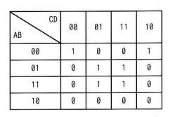

## 問題文

A, B, C, D を論理変数とするとき，次のカルノー図と等価な論理式はどれか。ここで，・は論理積，+は論理和，X̅はXの否定を表す。

| AB＼CD | 00 | 01 | 11 | 10 |
|:--:|:--:|:--:|:--:|:--:|
| 00 | 1 | 0 | 0 | 1 |
| 01 | 0 | 1 | 1 | 0 |
| 11 | 0 | 1 | 1 | 0 |
| 10 | 0 | 0 | 0 | 0 |

ア　A・B・C̅・D + B̅・D̅
イ　Ā・B̅・C̅・D̅ + B・D
ウ　A・B・D + B̅・D̅
エ　Ā・B̅・D̅ + B・D

## 参照画像

## 正解

**エ**：Ā・B̅・D̅ + B・D

## 選択肢補足

| 選択肢 | 内容 | 補足 |
|:--|:--|:--|
| ア | A・B・C̅・D + B̅・D̅ | AB=11,CD=01のみ対応、A=0側のマスをカバーできない |
| イ | Ā・B̅・C̅・D̅ + B・D | 前半項がAB=00,CD=00の1マスのみで、AB=00,CD=10をカバーできない |
| ウ | A・B・D + B̅・D̅ | AB=11側は正しいがAB=01側（B・Dの一部）をカバーできない |
| **エ** | **Ā・B̅・D̅ + B・D** | **正解。カルノー図の6つの1をすべて過不足なくカバーする** |

## 解き方

1. カルノー図の中で値が1になっているマスを洗い出す。
   - AB=00：CD=00, CD=10
   - AB=01：CD=01, CD=11
   - AB=11：CD=01, CD=11
2. 隣接する1のマスをできるだけ大きい矩形（2のべき乗個）でグループ化する。
   - グループ1：AB=00の行でCD=00とCD=10（CD列で見るとD=0の2マス）→ A̅・B̅・D̅
   - グループ2：AB=01とAB=11の行でCD=01とCD=11（A=0でもA=1でも成立し、Cは0,1両方）→ B・D
3. 各グループから論理積の項を作り、論理和でつなぐ。
   - A̅・B̅・D̅ + B・D
4. 全6マスの1が過不足なくカバーされていることを確認する。
5. 選択肢と照合し、一致する**エ**が正解と判断する。