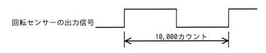

## 問題文

モーターの軸に装着された回転センサーから出力されるパルスの周期を，1MHzのクロック周波数でカウントアップするタイマーで計測したところ，10,000カウントであった。モーターの回転数は毎秒何回転か。ここで，回転センサーはモーターの軸が1回転するごとに図のようなパルスを2回出力するものとする。

回転センサーの出力信号（10,000カウントの幅を示す図）

ア　50　　イ　100　　ウ　200　　エ　5,000

## 参照画像

<!-- 画像がある場合:  -->

## 正解

**イ**：100

## 選択肢補足

| 選択肢 | 内容 | 補足 |
|:--|:--|:--|
| ア | 50 | パルス1周期をモーター2回転分と誤って計算した場合の値 |
| **イ** | **100** | **正解。1MHz÷10,000カウント＝100Hz（パルス周期の繰り返し回数）が、そのままモーターの回転数となる** |
| ウ | 200 | パルス1周期をモーター0.5回転分と誤って計算した場合の値 |
| エ | 5,000 | 10,000カウントを2で割っただけの誤った計算 |

## 解き方

1. クロックの1カウントあたりの時間を求める。
   - クロック周波数は1MHz（1秒間に1,000,000カウント）なので、1カウント＝1/1,000,000秒＝1マイクロ秒。
2. パルス1周期にかかる時間を求める。
   - 計測結果は10,000カウントなので、10,000カウント×1マイクロ秒＝10,000マイクロ秒＝0.01秒。
3. パルスが1秒間に何回繰り返されるか（周波数）を求める。
   - 1秒 ÷ 0.01秒 ＝ 100回/秒。
4. パルスの繰り返し回数とモーターの回転数の関係を確認する。
   - 図に示された「10,000カウント」の区間は、回転センサーが出力するパルスの1周期（モーター1回転に対応する波形ひとまとまり）を表している。
   - したがって、パルスの周期が1秒間に100回繰り返される＝モーターも1秒間に100回転している。
5. 以上より、モーターの回転数は毎秒**100回転**であり、選択肢**イ**が正解と判断する。