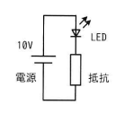

## 問題文

図のLED点灯回路において，LEDに10ミリAの電流が流れるように抵抗値を決定したときに，回路全体の消費電力に占めるLEDの消費電力の割合は何％か。ここで，LEDの順方向電圧は2Vとし，電源の消費電力は無視するものとする。

回路図：電源10V－LED（順方向電圧2V）と抵抗の直列回路

ア　20　　イ　25　　ウ　80　　エ　100

## 参照画像

<!-- 画像がある場合:  -->

## 正解

**ア**：20

## 選択肢補足

| 選択肢 | 内容 | 補足 |
|:--|:--|:--|
| **ア** | **20** | **正解。LEDの消費電力20mW÷回路全体の消費電力100mW×100＝20%** |
| イ | 25 | LEDの消費電力(20mW)を抵抗の消費電力(80mW)で割った値を誤って百分率にした場合の数値 |
| ウ | 80 | 抵抗の消費電力が回路全体に占める割合（LEDではなく抵抗側の割合） |
| エ | 100 | 電源電圧の値をそのまま百分率と誤認した場合の数値、または計算過程の誤り |

## 解き方

1. 回路の構成を確認する。
   - 電源（10V）、LED（順方向電圧2V）、抵抗が直列に接続されている。
   - 直列回路なので、LEDと抵抗には同じ電流（10mA）が流れる。
2. 抵抗にかかる電圧を求める。
   - 直列回路では各素子の電圧降下の合計が電源電圧に等しいので、抵抗の電圧＝電源電圧－LEDの順方向電圧＝10V－2V＝8V。
3. LEDと抵抗それぞれの消費電力を求める（消費電力＝電圧×電流）。
   - LEDの消費電力：2V × 10mA = 20mW
   - 抵抗の消費電力：8V × 10mA = 80mW
4. 回路全体の消費電力を求める。
   - 電源の消費電力は無視するので、回路全体の消費電力＝LEDの消費電力＋抵抗の消費電力＝20mW＋80mW＝100mW。
5. LEDの消費電力が回路全体に占める割合を求める。
   - 20mW ÷ 100mW × 100 ＝ 20%
6. 計算結果と選択肢を照合し、一致する**ア**を正解と判断する。