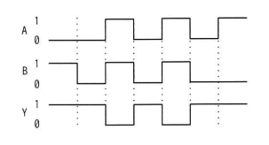
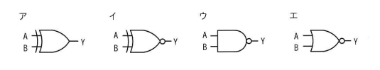

## 問題文

入力がAとB，出力がYの論理回路を動作させたとき，図のタイミングチャートが得られた。この論理回路として，適切なものはどれか。

（タイミングチャート：A, B, Yの波形図）

ア　ORゲート（入力側に二重線、出力に否定円なし）
イ　NORゲート（入力側に二重線、出力に否定円あり）
ウ　NANDゲート（AND形状、出力に否定円あり）
エ　NORゲート（OR形状、出力に否定円あり）

## 参照画像

## 正解

**ウ**：NANDゲート

## 選択肢補足

| 選択肢 | 内容 | 補足 |
|:--|:--|:--|
| ア | ORゲート | A=0,B=0のときY=0になるはずだが、チャートではY=1のため不一致 |
| イ | NORゲート | A=0,B=0のときY=1にはなるが、A=0,B=1のときもY=0になるはずで、チャートのY=1と不一致 |
| **ウ** | **NANDゲート** | **正解。AとBがともに1のときのみY=0になり、それ以外（0,0／0,1／1,0）は常にY=1になるという真理値表がチャートと完全に一致する** |
| エ | NORゲート | イと同様にOR系否定ゲートであり、A=0,B=1のときY=0になってしまうため、チャートのY=1と不一致 |

## 解き方

1. タイミングチャートを区間ごとに読み取り、A・B・Yの値を真理値表の形にまとめる。
   - A=0, B=0 → Y=1
   - A=0, B=1 → Y=1
   - A=1, B=1 → Y=0
2. AとBがともに1のときだけYが0になり、それ以外は常にYが1になるという規則性を見つける。
3. この規則性を、基本的な論理ゲートの真理値表と比較する。
   - OR：A=0,B=0のときY=0になるため不一致。
   - NOR：A=0,B=1のときY=0になるため不一致。
   - NAND：A・Bがともに1のときのみ出力0、それ以外はすべて出力1であり、チャートの規則性と完全に一致する。
4. 選択肢の図記号を確認し、AND形状（四角に近い形）で出力に否定円がついているものを選ぶ。これがNANDゲートの記号である。
5. 真理値表・図記号の両方が一致する**ウ**を正解と判断する。