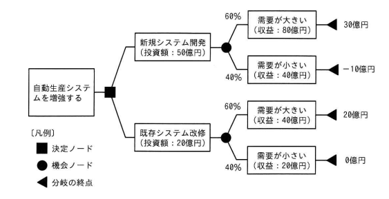

## 問題文

自動生産システムの増強に関する次のデシジョンツリーにおいて，新規にシステムを開発する場合の期待金額価値（EMV）は何億円か。

〔デシジョンツリーの内容〕
自動生産システムを増強する（決定ノード）
├ 新規システム開発（投資額：50億円）
│　├ 60%　需要が大きい（収益：80億円）→ 30億円
│　└ 40%　需要が小さい（収益：40億円）→ −10億円
└ 既存システム改修（投資額：20億円）
　├ 60%　需要が大きい（収益：40億円）→ 20億円
　└ 40%　需要が小さい（収益：20億円）→ 0億円

ア　14　　イ　20　　ウ　26　　エ　64

## 参照画像

## 正解

**ア**：14

## 選択肢補足

| 選択肢 | 内容 | 補足 |
|:--|:--|:--|
| **ア** | **14** | **正解。新規システム開発の各分岐の純パスバリュー（30億円，−10億円）に発生確率（60%，40%）を掛けて合計した値** |
| イ | 20 | 既存システム改修の場合のEMV（20×0.6＋0×0.4＝12億円）と混同するなど、別の枝の計算と取り違えた場合に生じうる値 |
| ウ | 26 | 確率の掛け方や符号の扱いを誤った場合に生じうる値 |
| エ | 64 | 収益額（80億円，40億円）をそのまま確率計算に用い，投資額の差し引きを忘れた場合（80×0.6＋40×0.4＝64億円）に生じる典型的な誤答 |

## 解き方

1. 問題文のキーワードを整理する。
   - 「新規にシステムを開発する場合」の期待金額価値（EMV）を求める問題であり，デシジョンツリーの上側の枝（新規システム開発）に着目すればよい。
2. EMV（期待金額価値）の計算方法を確認する。
   - EMVは，各分岐の「純パスバリュー（収益－投資額などの正味の効果金額）」に，その分岐が発生する確率を掛けたものを，すべての分岐について合計して求める。
3. 新規システム開発における各分岐の純パスバリューを求める。
   - 需要が大きい場合：収益80億円－投資額50億円＝**30億円**（図にも明記）。
   - 需要が小さい場合：収益40億円－投資額50億円＝**−10億円**（図にも明記）。
4. 各分岐の発生確率を確認する。
   - 需要が大きい：60%
   - 需要が小さい：40%
5. EMVを計算する。
   - EMV ＝（30億円 × 0.6）＋（−10億円 × 0.4）
   - ＝ 18億円 ＋（−4億円）
   - ＝ **14億円**
6. 投資額をすでに差し引いた図中の数値（30億円，−10億円）を用いることが重要である点に注意する。
   - 収益額（80億円，40億円）をそのまま確率計算に使うと投資額を考慮し忘れた誤答（エの64億円）になってしまうため，必ず投資額差引後の純パスバリューを用いる。
7. 以上より，新規システム開発のEMVは14億円であることから，**ア**を正解と判断する。