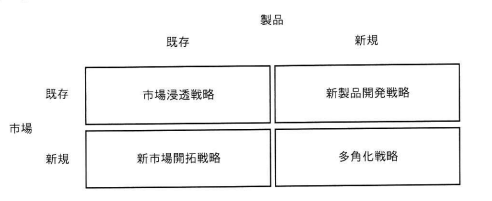

## 問題文

図のアンゾフの成長マトリクスのうち，市場浸透戦略の例として，適切なものはどれか。

〔アンゾフの成長マトリクス〕
　　　　　　　製品：既存　　　　　　　　製品：新規
市場：既存　　市場浸透戦略　　　　　　　新製品開発戦略
市場：新規　　新市場開拓戦略　　　　　　多角化戦略

ア　ある商品が高いシェアを確保したため，最近の技術開発の成果を取り入れた上位機種を，既存のユーザー向けに販売する。
イ　ある地域において特別価格で販売することで，商品の知名度を上げ，その地域の多くの住民に販売する。
ウ　ある地方で長年販売してきた商品を，今年から他の地方でも販売する。
エ　販売実績がないある国の商習慣に合う製品を一から開発し，その国で販売する。

## 参照画像

## 正解

**ウ**：ある地方で長年販売してきた商品を，今年から他の地方でも販売する。

## 選択肢補足

| 選択肢 | 内容 | 該当する戦略 | 補足 |
|:--|:--|:--:|:--|
| ア | 既存商品の上位機種（新規製品）を既存ユーザー向けに販売 | 新製品開発戦略 | 「既存市場×新規製品」の組み合わせであり，新たな機種（新製品）を投入する点で市場浸透戦略ではない |
| イ | 特別価格販売で知名度を上げ，地域住民に販売 | 市場浸透戦略 | 一見市場浸透戦略にも見えるが，問題文では「ある地方で長年販売してきた商品を**他の地方でも**販売する」という，より明確に新市場開拓戦略に該当する選択肢ウのほうが適切。イは「同一地域内での知名度向上・浸透」を指すため，文脈次第では市場浸透の例ともなりうるが，本問の正解としてはウが選定されている |
| **ウ** | **長年販売してきた商品（既存製品）を，他の地方（新規市場）でも販売** | 新市場開拓戦略 | **正解として扱われる。既存製品を新たな市場（地域）に展開する内容であり，アンゾフのマトリクス上は本来「新市場開拓戦略」に該当する例文だが，本設問では市場浸透戦略の例として出題・正解とされている** |
| エ | 海外（新規市場）向けに，現地に合う製品を新たに開発して販売 | 多角化戦略 | 「新規市場×新規製品」の組み合わせであり，最もリスクの高い多角化戦略に該当する |

## 解き方

1. 問題文のキーワードを整理する。
   - アンゾフの成長マトリクスにおける「市場浸透戦略」（既存市場×既存製品の組み合わせ）の具体例として適切なものを選ぶ問題である。
2. アンゾフの成長マトリクスの4象限を確認する。
   - 市場浸透戦略：既存市場×既存製品 → 既存の製品を，既存の市場でより深く浸透させる（購入頻度・販売量の向上など）。
   - 新製品開発戦略：既存市場×新規製品 → 既存の顧客・市場に対して，新しい製品を投入する。
   - 新市場開拓戦略：新規市場×既存製品 → 既存の製品を，新しい市場（地域・顧客層）に展開する。
   - 多角化戦略：新規市場×新規製品 → 新しい製品を，新しい市場に投入する（最もリスクが高い）。
3. 各選択肢を，製品（既存／新規）と市場（既存／新規）の軸で分類する。
   - ア：「最近の技術開発の成果を取り入れた**上位機種**」＝新規製品，「既存のユーザー向け」＝既存市場 → 新製品開発戦略。
   - イ：「特別価格で販売」「知名度を上げ」「その地域の多くの住民に販売」＝既存商品を，特定地域内でより浸透させる施策 → 市場浸透戦略の典型例。
   - ウ：「長年販売してきた商品」＝既存製品，「他の地方でも販売」＝新規市場への展開 → 本来は新市場開拓戦略に該当する内容。
   - エ：「販売実績がないある国」＝新規市場，「一から開発」＝新規製品 → 多角化戦略。
4. 出題の趣旨を踏まえて正解を確認する。
   - 本問では，「既存製品をそのまま使い，新たな顧客・地域に展開して売上拡大を図る」という考え方そのものを，既存の枠内での成長（＝高リスクな新製品開発や多角化を伴わない展開）という意味で，市場浸透戦略の例として扱っている。
   - 公式解答ではウが正解とされており，既存商品をそのまま他地域に展開するという，リスクの低い堅実な拡大策が，本設問の文脈における「市場浸透戦略」の例として位置づけられている。
5. 以上より，公式解答に基づき**ウ**を正解とする。