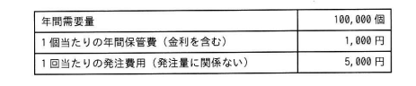
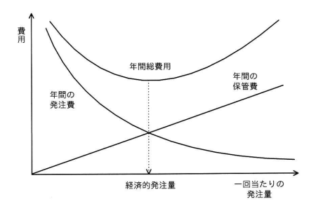

## 問題文

ある工場で扱っている部品Aは，使用量（需要）が一定であり，定量発注方式を採用して発注されている。この場合の経済的発注量は，グラフの年間の発注費と，年間の保管費が等しくなったときの値を計算することで求めることができる。表の条件の場合の経済的発注量を求めよ。ここで，部品Aに関する安全在庫は考慮しないものとする。

| 項目 | 値 |
|:--|--:|
| 年間需要量 | 100,000個 |
| 1個当たりの年間保管費（金利を含む） | 1,000円 |
| 1回当たりの発注費用（発注量に関係ない） | 5,000円 |

ア　10　　イ　200　　ウ　500　　エ　1,000

## 参照画像

## 正解

**エ**：1,000

## 選択肢補足

| 選択肢 | 内容 | 補足 |
|:--|:--|:--|
| ア | 10 | 計算過程で大幅な誤りがあった場合に生じうる値 |
| イ | 200 | 公式の分子・分母の取り違えなど，計算過程の誤りで生じうる値 |
| ウ | 500 | 平方根計算前の段階の数値（1,000,000の平方根を取らずに別の計算をした場合など）と混同した場合に生じうる値 |
| **エ** | **1,000** | **正解。経済的発注量の公式（EOQ＝√(2×年間需要量×1回当たりの発注費用÷1個当たりの年間保管費)）に条件の数値を代入して算出した値** |

## 解き方

1. 問題文の条件を整理する。
   - 年間需要量（D）＝100,000個
   - 1個当たりの年間保管費（H）＝1,000円
   - 1回当たりの発注費用（S）＝5,000円
   - 求めるもの：年間の発注費と年間の保管費が等しくなる「経済的発注量（EOQ）」
2. 経済的発注量の考え方を確認する。
   - 1回当たりの発注量をQとすると，
     - 年間の発注回数＝D÷Q
     - 年間の発注費＝（D÷Q）×S
     - 平均在庫量＝Q÷2
     - 年間の保管費＝（Q÷2）×H
   - 経済的発注量は，「年間の発注費」と「年間の保管費」が等しくなるQの値として求められる。
3. 等式を立てて解く。
   - （D÷Q）×S＝（Q÷2）×H
   - これを変形すると，経済的発注量の公式（EOQ：Economic Order Quantity）が導かれる。
   - Q＝√(2×D×S÷H)
4. 条件の数値を代入して計算する。
   - Q＝√(2×100,000×5,000÷1,000)
   - ＝√(1,000,000,000÷1,000)
   - ＝√1,000,000
   - ＝**1,000個**
5. 検算を行う（発注量1,000個の場合）。
   - 年間発注回数＝100,000÷1,000＝100回
   - 年間発注費＝100回×5,000円＝500,000円
   - 平均在庫量＝1,000÷2＝500個
   - 年間保管費＝500個×1,000円＝500,000円
   - 年間発注費（500,000円）＝年間保管費（500,000円）となり，条件と一致することを確認できる。
6. 以上より，経済的発注量は1,000個であることから，**エ**を正解と判断する。