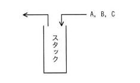

## 問題文

A，B，C の順序で入力されるデータがある。各データについてスタックへの挿入と取出しを1回ずつ行うことができる場合，データの出力順序は何通りあるか。

（図：A, B, C が右からスタックに挿入され、左に取り出される構成）

ア　3　　イ　4　　ウ　5　　エ　6

## 参照画像

<!-- 画像がある場合:  -->

## 正解

**ウ**：5

## 選択肢補足

| 選択肢 | 内容 | 補足 |
|:--|:--|:--|
| ア | 3 | 実際に列挙できる出力パターン数より少なく、考慮漏れがある |
| イ | 4 | 実際に列挙できる出力パターン数より少なく、考慮漏れがある |
| **ウ** | **5** | **正解。push／popの組み合わせを全列挙すると、スタック構造上可能な出力順序は5通りとなる（カタラン数 C₃＝5 と一致）** |
| エ | 6 | 3個の要素の単純な順列数（3！＝6）であり、スタックという後入れ先出し（LIFO）の制約を考慮していない誤った値 |

## 解き方

1. スタックの性質を確認する。
   - スタックは後入れ先出し（LIFO：Last In First Out）の構造であり、挿入（push）した順序とは逆順でしか取り出す（pop）ことができない制約がある。
   - そのため、入力順序が A, B, C の3個であっても、出力順列は単純な3！＝6通りにはならず、一部のパターンは実現不可能となる。
2. push と pop の操作列を全探索する。
   - A, B, C の挿入（push）と取出し（pop）をそれぞれ1回ずつ、スタックの制約（popする際はスタックが空でないこと、全データがpushされappendされた後に最終的にスタックが空になること）を満たす形で全パターンを列挙する。
3. 実際に列挙して出力順序を確認する。
   - (A, B, C)：A,B,Cを順にpush・popした場合
   - (A, C, B)：A push→pop、B,C push後、C→B の順でpop
   - (B, A, C)：A,B push後、B→A の順でpop、その後C push→pop
   - (B, C, A)：A,B push後、B pop、C push→pop、最後にA pop
   - (C, B, A)：A,B,C を全てpushしてから、C→B→A の順でpop
   - 以上の5パターンが、スタック構造上実現可能な出力順序として得られる。
4. 実現不可能なパターンを確認する。
   - 例えば (C, A, B) は、Cを先に取り出すには A, B が先にpushされている必要があるが、その後Aを先にpopするにはBより先にAがスタックの上に来る必要があり、LIFOの制約上実現できない。
5. 以上より、スタックを用いた場合の出力順序は **5通り（ウ）** であると判断する。これは一般に、n個の要素に対するスタックでの実現可能な出力順列数が「カタラン数」 C_n＝(2n)!／((n+1)!n!) で求められることとも一致する（n＝3のときC₃＝5）。