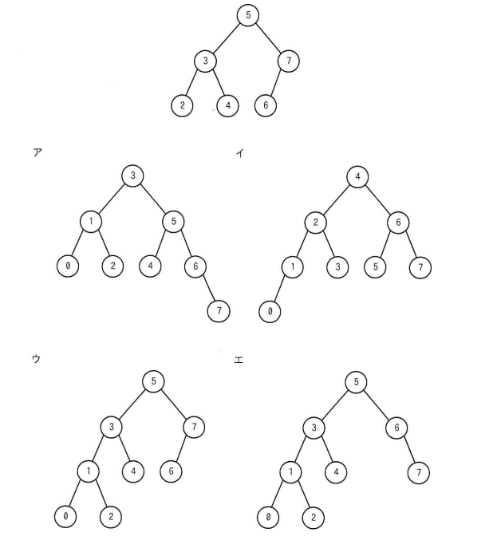

## 問題文

図の2分探索木に1と0の二つの要素を順に追加したAVL木として，適切なものはどれか。

（初期の2分探索木：ルート5、左部分木は3(左2, 右4)、右部分木は7(左6)）

選択肢ア〜エはそれぞれ異なる木構造（詳細は参照画像参照）。

## 参照画像



## 正解

**ウ**

最終的な木構造：
```
        5
      /   \
     3     7
    / \   /
   1   4 6
  / \
 0   2
```

## 選択肢補足

| 選択肢 | 内容 | 補足 |
|:--|:--|:--|
| ア | ルートが3 | 元の木全体が過剰に再構成された形になっており、AVL木の局所的な回転規則と一致しない |
| イ | ルートが4 | 元の木全体が過剰に再構成された形になっており、AVL木の局所的な回転規則と一致しない |
| **ウ** | **5-(3,7)，3-(1,4)，1-(0,2)，7-(6)** | **正解。1挿入後に2の左部分木の高さ超過が発生し、2を根とする部分木で右回転を行うことでバランスを回復した結果と一致** |
| エ | 5-(3,6)，6-(右に7) | 右側部分木の構造が誤っており、6の位置・7の接続が実際のシミュレーション結果と異なる |

## 解き方

1. 初期の2分探索木の構造とバランス状態を確認する。
   - ルート5、左の子3（さらに左2、右4）、右の子7（左6）という構成。
   - この時点ではすべてのノードでバランス（左右の高さの差）が±1以内に収まっており、AVL木として平衡が取れている。
2. 「1」を挿入する。
   - 2分探索木の規則に従い、5→3→2と進み、2の左の子として1が追加される。
   - 挿入後、ノード2の左部分木の高さが1、右部分木の高さが0となり、バランス因子は+1で許容範囲内（AVL条件を満たす）。
   - 上位のノード3，5でもバランス因子を再計算するが、いずれも±1以内に収まるため、この時点では回転は発生しない。
3. 「0」を挿入する。
   - 2分探索木の規則に従い、5→3→2→1と進み、1の左の子として0が追加される。
   - 挿入後、ノード2の左部分木（1を根とする部分木）の高さが2、右部分木の高さが0となり、バランス因子が+2となってAVL条件（±1以内）に違反する。
4. 不均衡の種類を判定し、回転を行う。
   - 不均衡が発生したノード2に対して、挿入位置が「左の子（1）のさらに左（0）」であるため、これはLL型（Left-Left）の不均衡である。
   - LL型の場合は、不均衡ノード（2）を中心に**右回転**を1回行うことでバランスを回復する。
   - 右回転の結果、1が新たな部分木の根となり、0が左の子、2が右の子という構成になる。
5. 回転後の木全体を確認する。
   - 回転はノード2を中心とした局所的な部分木内でのみ行われるため、上位のノード3，5や右側の部分木（7，6）の構造には影響しない。
   - 最終的な木構造は、ルート5、左の子3（左に1[左0，右2]，右4），右の子7（左6）となる。
6. この結果が選択肢**ウ**の構造と完全に一致することを確認し、ウを正解と判断する。