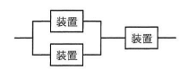
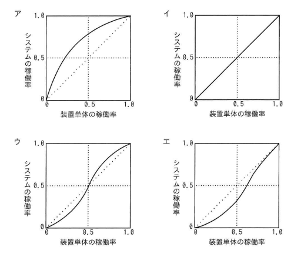

## 問題文

図のように3個の装置を並列と直列に組み合わせて構成したシステムがある。装置単体の稼働率と，システムの稼働率の関係を示したグラフはどれか。ここで，3個の装置の稼働率は，全て等しいものとする。

（構成：2台の装置を並列接続し、その並列部分にさらに1台の装置を直列接続）

## 参照画像

<!-- 画像がある場合:  -->

## 正解

**エ**：対角線（y＝x）より下を通り，装置単体の稼働率が0.5付近で対角線との差が最も大きくなる凹型のカーブ

## 選択肢補足

| 選択肢 | 内容 | 補足 |
|:--|:--|:--|
| ア | 原点から急に立ち上がり，対角線より上を通る凹型カーブ | 並列＋直列構成の場合、システム稼働率は装置単体の稼働率より低くなる区間があるため、常に対角線より上に位置するこのグラフとは一致しない |
| イ | 対角線そのもの（直線） | システム稼働率＝装置単体の稼働率となるのは単一装置構成の場合であり、並列・直列を組み合わせた本構成には当てはまらない |
| ウ | 対角線をまたいでS字に交差するカーブ | 実際の計算結果では装置単体の稼働率が0と1の端点以外は常に対角線より下に位置し、対角線をまたぐ交差は発生しないため不一致 |
| **エ** | **対角線より下を通り，0.5付近で差が最大になる凹型カーブ** | **正解。計算結果は装置単体の稼働率0と1で一致し、それ以外（特に0.5付近）では常にシステム稼働率が下回るカーブとなり、実際の計算値と一致する** |

## 解き方

1. システムの構成を確認する。
   - 図より、2台の装置を並列に接続した部分に、さらに1台の装置を直列に接続した構成である（並列2台 → 直列1台）。
2. 並列部分の稼働率を計算する式を立てる。
   - 装置単体の稼働率を a とすると、並列接続された2台のうち少なくとも1台が稼働していればよいため、並列部分の稼働率は「1－(両方とも故障している確率)」＝1－(1－a)² となる。
3. システム全体（並列部分＋直列の1台）の稼働率を計算する式を立てる。
   - 直列接続では、すべての構成要素が稼働している必要があるため、システム全体の稼働率は「並列部分の稼働率 × 直列装置の稼働率」＝[1－(1－a)²] × a となる。
4. 具体的な a の値を代入してシステム稼働率を計算し、対角線（y＝x，単体の稼働率とシステムの稼働率が等しい場合の基準線）と比較する。
   - a＝0：システム稼働率＝0（対角線と一致）
   - a＝0.5：システム稼働率＝[1－0.25]×0.5＝0.375（対角線の0.5より下回る）
   - a＝0.9：システム稼働率＝[1－0.01]×0.9＝0.891（対角線の0.9よりわずかに下回る）
   - a＝1.0：システム稼働率＝1（対角線と一致）
5. 計算結果から、グラフの形状を判断する。
   - a＝0とa＝1の両端点では対角線と一致し、それ以外の区間（特にa＝0.5付近）では常にシステム稼働率が装置単体の稼働率を下回る、対角線の下を通る凹型のカーブとなる。
6. この特徴と完全に一致する**エ**を正解と判断する。