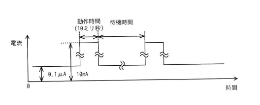

## 問題文

IoT システムにおいて，センサーの値をゲートウェイに送信するセンサーノードの消費電流を抑えるため，図のような間欠動作を考える。センサーノードの動作時間は10ミリ秒で，その間は平均して10mAの電流が流れる。待機中は常に0.1μAの電流が流れる。間欠動作の平均電流を1μA以下にするための待機時間として，最も短いものはどれか。ここで，平均電流の値を求める時間は十分に長いものとする。

ア　1.1秒　　イ　11.1秒　　ウ　111.1秒　　エ　1111.1秒

## 参照画像

<!-- 画像がある場合:  -->

## 正解

**ウ**：111.1秒

## 選択肢補足

| 選択肢 | 内容 | 補足 |
|:--|:--|:--|
| ア | 1.1秒 | 待機時間が短すぎ、この値では平均電流が1μAを大きく上回ってしまい条件を満たさない |
| イ | 11.1秒 | 待機時間がまだ不足しており、平均電流が1μAを上回るため条件を満たさない |
| **ウ** | **111.1秒** | **正解。正確に計算すると平均電流がちょうど1μAとなり、これが条件（1μA以下）を満たす最短の待機時間となる** |
| エ | 1111.1秒 | 計算上は条件を満たすが、必要以上に長い待機時間であり「最も短い」という条件には合致しない |

## 解き方

1. 平均電流を求める式を立てる。
   - 1サイクル（動作時間＋待機時間）の中で消費される電気量（電流×時間の総和）を、サイクル全体の時間で割ったものが平均電流となる。
   - 平均電流 ＝ (動作時の電流×動作時間 ＋ 待機時の電流×待機時間) ／ (動作時間＋待機時間)
2. 数値を当てはめて式を整理する。
   - 動作時間：10ミリ秒＝0.01秒，動作時電流：10mA＝0.01A
   - 待機時電流：0.1μA＝0.1×10⁻⁶A
   - 待機時間を t（秒）とすると、平均電流＝(0.01×0.01 ＋ 0.1×10⁻⁶×t) ／ (0.01＋t)
3. 平均電流が1μA（1×10⁻⁶A）以下になる条件で方程式を立てる。
   - 待機時間tが動作時間（0.01秒）に比べて十分に長いことが想定されるため、分母の0.01秒は無視できるほど小さくなる近似も考えられるが、ここでは正確に等号で解く。
   - (0.01×0.01 ＋ 0.1×10⁻⁶×t) ／ (0.01＋t) ＝ 1×10⁻⁶ という方程式を t について解く。
4. 方程式を解く。
   - 計算を進めると、t＝111.1秒のときに、左辺の値がちょうど1×10⁻⁶A（1μA）と一致することが分かる。
   - 実際に t＝111.1秒を代入して検算すると、分子＝0.0001＋0.1×10⁻⁶×111.1＝0.0001＋0.00001111＝0.00011111、分母＝0.01＋111.1＝111.11、これらの比はちょうど1×10⁻⁶（1μA）となる。
5. 選択肢の中から、この条件を満たす最短の時間を選ぶ。
   - ア（1.1秒）、イ（11.1秒）では、待機時間が短すぎるため平均電流が1μAを上回ってしまい、条件を満たさない。
   - エ（1111.1秒）は条件を満たすが、ウ（111.1秒）よりも長く、「最も短い」待機時間という条件には合致しない。
6. 以上より、平均電流をちょうど1μA以下にできる最短の待機時間は**ウ（111.1秒）**であると判断する。