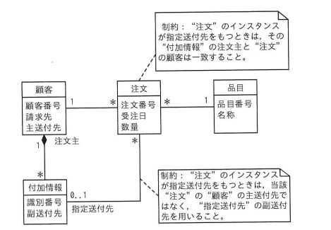

## 問題文

UML を用いて表した図のデータモデルを関係データベース上に実装する際の解釈のうち，適切なものはどれか。

（クラス図の構成）
- 顧客（顧客番号，請求先，主送付先）－1対多－注文（注文番号，受注日，数量）
- 顧客（1）－1対多（*）－付加情報（識別番号，副送付先）：役割名「注文主」
- 注文（*）－0..1－付加情報：役割名「指定送付先」
- 注文（*）－1－品目（品目番号，名称）

制約1：「"注文"のインスタンスが指定送付先をもつときは，その"付加情報"の注文主と"注文"の顧客は一致すること。」
制約2：「"注文"のインスタンスが指定送付先をもつときは，当該"注文"の"顧客"の主送付先ではなく，"指定送付先"の副送付先を用いること。」

ア　"指定送付先"を指定する際，"付加情報"表のどの行でも選択できる。
イ　"付加情報"表と"顧客"表の行数は一致していなければならない。
ウ　"付加情報"表には"顧客"表に対する参照制約を指定する。
エ　"付加情報"表には"注文"表に対する参照制約を指定する。

## 参照画像

<!-- 画像がある場合:  -->

## 正解

**ウ**：“付加情報”表には“顧客”表に対する参照制約を指定する。

## 選択肢補足

| 選択肢 | 内容 | 補足 |
|:--|:--|:--|
| ア | 付加情報表のどの行でも選択できる | 制約1により、「指定送付先」として選べる"付加情報"は、その付加情報の"注文主"が当該"注文"の"顧客"と一致するものに限られるため、どの行でも自由に選べるわけではなく誤り |
| イ | 付加情報表と顧客表の行数が一致 | クラス図上、顧客と付加情報の関連の多重度は「顧客側1，付加情報側*（複数）」であり、1人の顧客が複数の付加情報をもつことができるため、両表の行数が一致する必然性はなく誤り |
| **ウ** | **付加情報表が顧客表を参照** | **正解。"注文主"という役割名をもつ「顧客（1）－付加情報（*）」の関連から、1件の付加情報インスタンスは必ず1人の顧客（注文主）に対応するため、関係データベース上では"付加情報"表が"顧客"表（注文主の顧客番号）に対する外部キー（参照制約）をもつ実装になる** |
| エ | 付加情報表が注文表を参照 | "指定送付先"の関連は、注文側の多重度が0..1であり「1つの注文が高々1つの付加情報を指定送付先としてもつ」という関係であるため、外部キーは"注文"表側が"付加情報"表を参照する形で実装されるのが自然であり、逆方向を示すこの記述は誤り |

## 解き方

1. クラス図に示された各関連とその多重度を整理する。
   - 顧客（1）－注文（*）：1人の顧客が複数の注文をもつ。
   - 顧客（1）－付加情報（*）［役割名：注文主］：1人の顧客が複数の付加情報（注文主としての立場）をもつ。
   - 注文（*）－付加情報（0..1）［役割名：指定送付先］：1つの注文は、指定送付先として0個または1個の付加情報をもつことができる（任意の関連）。
   - 注文（*）－品目（1）：1つの注文は1つの品目に対応する。
2. 関係データベースにおける一般的な実装ルールを確認する。
   - UMLのクラス図における「1対多」の関連を関係データベースに実装する場合、一般に「多」側のテーブルが「1」側のテーブルの主キーを参照する外部キー（参照制約）をもつ形になる。
3. 「注文主」の関連について、外部キーの方向を判断する。
   - 「顧客（1）－付加情報（*）」の関連において、「多」側にあたるのは付加情報であるため、"付加情報"表が"顧客"表（顧客番号）を参照する外部キー（注文主用の参照制約）をもつ実装になる。
4. 「指定送付先」の関連について、外部キーの方向を判断する。
   - 「注文（*）－付加情報（0..1）」の関連において、注文側の多重度が"*"、付加情報側が"0..1"であることから、1つの付加情報インスタンスに対応する注文は複数存在しうる一方、1つの注文に対応する付加情報（指定送付先）は高々1つに限られる。
   - この場合、外部キーは多重度が0..1（高々1）に制限されている側、つまり"注文"表側に置かれ、"注文"表が"付加情報"表（識別番号）を参照する形で実装されるのが自然である。
5. 各選択肢を、上記の整理した実装内容と照合する。
   - ア：制約1により、付加情報のどの行でも自由に指定送付先として選べるわけではなく、注文主が一致する行に限定されるため誤り。
   - イ：顧客と付加情報の関連は「1対多」であり、行数が一致する必然性はないため誤り。
   - ウ：「注文主」の関連から導かれる、"付加情報"表が"顧客"表を参照する外部キー（参照制約）の実装と一致するため正しい。
   - エ：「指定送付先」の関連における外部キーの方向は、付加情報表ではなく注文表側に置かれるのが自然であるため、記述が逆方向であり誤り。
6. 以上の整理から、クラス図の関連と多重度の解釈として適切な**ウ**を正解と判断する。