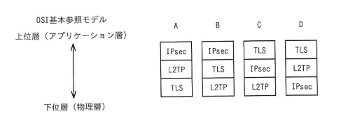

## 問題文

VPNで使用されるプロトコルであるIPsec，L2TP，TLSの，OSI基本参照モデルにおける相対的な位置関係はどれか。

OSI基本参照モデル
上位層（アプリケーション層）
↕
下位層（物理層）

| | A | B | C | D |
|:--|:--|:--|:--|:--|
| 上位 | IPsec | IPsec | TLS | TLS |
| ↕ | L2TP | TLS | IPsec | L2TP |
| 下位 | TLS | L2TP | L2TP | IPsec |

ア　A　　イ　B　　ウ　C　　エ　D

## 参照画像

<!-- 画像がある場合:  -->

## 正解

**ウ**：C（上位から TLS → IPsec → L2TP の順）

## 選択肢補足

| 選択肢 | 内容 | 補足 |
|:--|:--|:--|
| ア | A（上位から IPsec → L2TP → TLS） | IPsecが最上位、TLSが最下位という並びになっており、各プロトコルの本来の階層と一致しない |
| イ | B（上位から IPsec → TLS → L2TP） | IPsecがTLSより上位に置かれており、ネットワーク層（IPsec）とトランスポート層（TLS）の上下関係が逆になっている |
| **ウ** | **C（上位から TLS → IPsec → L2TP）** | **正解。TLSはトランスポート層（第4層）、IPsecはネットワーク層（第3層）、L2TPはデータリンク層（第2層）で動作するため、上位層から順にTLS→IPsec→L2TPと並ぶ** |
| エ | D（上位から TLS → L2TP → IPsec） | TLSの位置は正しいが、L2TP（データリンク層）とIPsec（ネットワーク層）の上下関係が逆になっている |

## 解き方

1. 問題文のキーワードを整理する。
   - IPsec、L2TP、TLSという3つのVPN関連プロトコルについて、OSI基本参照モデル上での相対的な階層の高低（上位層〜下位層）を問う問題である。
2. 各プロトコルが動作するOSI参照モデルの層を確認する。
   - IPsec（Security Architecture for Internet Protocol）：IPパケット単位で暗号化・認証を行うプロトコルであり、IPが属する**ネットワーク層（第3層）**で動作する。
   - L2TP（Layer 2 Tunneling Protocol）：名称が示すとおり、PPPなどのデータリンク層のフレームをカプセル化してトンネリングするプロトコルであり、**データリンク層（第2層）**で動作する。暗号化機能を持たないため、実運用ではIPsecと組み合わせて使われることが多い。
   - TLS（Transport Layer Security）：通信の暗号化や改ざん検知、認証を行う統合的なセキュアプロトコルであり、その名のとおり**トランスポート層（第4層）**で動作する。
3. 3つの層を高低で並べる。
   - 上位層（高レイヤ）→下位層（低レイヤ）の順に並べると、トランスポート層（TLS）＞ネットワーク層（IPsec）＞データリンク層（L2TP）となる。
4. 図中の選択肢A〜Dと照合する。
   - 各選択肢の上から下への並びを確認し、「TLS→IPsec→L2TP」という順になっているものを探す。
5. 上位から「TLS、IPsec、L2TP」の順に並んでいる**C（選択肢ウ）**を正解と判断する。
