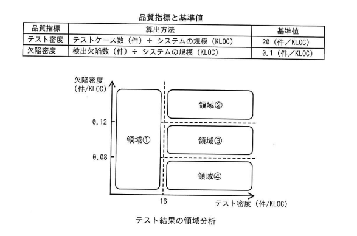

## 問題文

あるシステム開発プロジェクトのシステムテストにおけるテスト密度及び欠陥密度の値は，図に示した領域①～④のうち，領域④の範囲内であった。品質管理基準に照らして評価すると，行うべき活動として最も適切なものはどれか。ここで，このプロジェクトの品質管理基準では，定量評価の基準として，表に従ってテスト密度及び欠陥密度の基準値を設定した上で，テスト密度は基準値の80%以上であること，かつ，欠陥密度は基準値の80%以上120%未満であることと定めている。

〔品質指標と基準値〕

| 品質指標 | 算出方法 | 基準値 |
|:--|:--|:--|
| テスト密度 | テストケース数（件）÷システムの規模（KLOC） | 20（件/KLOC） |
| 欠陥密度 | 検出欠陥数（件）÷システムの規模（KLOC） | 0.1（件/KLOC） |

〔テスト結果の領域分析〕
縦軸：欠陥密度（件/KLOC）、横軸：テスト密度（件/KLOC）
境界線：テスト密度＝16（件/KLOC），欠陥密度＝0.08，0.12（件/KLOC）
領域①：テスト密度16未満（左側全体）
領域②：テスト密度16以上，欠陥密度0.12以上
領域③：テスト密度16以上，欠陥密度0.08以上0.12未満
領域④：テスト密度16以上，欠陥密度0.08未満

ア　欠陥密度は基準を満たしているが，システムの品質に問題がないか，欠陥の妥当性を確認する。
イ　システムの欠陥が多いので，検出した欠陥の原因を分析した上で，システムの品質改善に取り組む。
ウ　システムの欠陥を十分に検出できていない懸念があるので，テストの観点に漏れがないかなど，テストケースの妥当性を確認する。
エ　テスト密度が不足しているので，システムの規模に見合うテストケース数以上となるように，テストケースを追加する。

## 参照画像

<!-- 画像がある場合:  -->

## 正解

**ウ**：システムの欠陥を十分に検出できていない懸念があるので，テストの観点に漏れがないかなど，テストケースの妥当性を確認する。

## 選択肢補足

| 選択肢 | 内容 | 補足 |
|:--|:--|:--|
| ア | 欠陥密度は基準を満たしているので妥当性を確認する | 領域④は欠陥密度が基準値（0.1）の80%である0.08を下回る範囲であり、「基準を満たしている」という前提が誤り。欠陥密度は基準の下限を下回っている状態である |
| イ | システムの欠陥が多いので原因分析する | 領域④は欠陥密度が**低すぎる**（基準の下限未満の）領域であり、「欠陥が多い」という記述は実態と逆である。欠陥が多い状態は領域②（欠陥密度が基準の120%以上）に該当する |
| **ウ** | **欠陥を十分に検出できていない懸念があるので，テストケースの妥当性を確認する** | **正解。領域④はテスト密度が基準（16件/KLOC）を満たしているにもかかわらず，欠陥密度が基準の下限（0.08件/KLOC）を下回っている。これは，テストの量は十分実施されているように見えても，テストケースが見当違いであったり，特定の観点に偏っていたりして，本来検出されるべき欠陥を見逃している可能性を示唆する。そのため，テストの観点に漏れがないか，テストケースの内容が妥当かを確認する必要がある** |
| エ | テスト密度が不足しているのでテストケースを追加する | 領域④はテスト密度が基準値の80%（16件/KLOC）以上を満たす範囲であり、「テスト密度が不足している」という前提が誤り。テスト密度が不足している状態は領域①に該当する |

## 解き方

1. 問題文と図・表のキーワードを整理する。
   - テスト密度の基準値は20件/KLOC、欠陥密度の基準値は0.1件/KLOCであり、品質管理基準は「テスト密度は基準値の80%以上」「欠陥密度は基準値の80%以上120%未満」と定められている。
2. 基準値から実際の判定ライン（閾値）を計算する。
   - テスト密度の下限：20×0.8＝16（件/KLOC）→ 図の横軸の境界線16と一致。
   - 欠陥密度の下限：0.1×0.8＝0.08（件/KLOC）→ 図の縦軸の境界線0.08と一致。
   - 欠陥密度の上限：0.1×1.2＝0.12（件/KLOC）→ 図の縦軸の境界線0.12と一致。
3. 領域④の位置づけを確認する。
   - 図より、領域④はテスト密度が16以上（基準を満たしている）、かつ欠陥密度が0.08未満（基準の下限を下回る）の範囲である。すなわち「テストは基準量以上実施しているが、検出された欠陥が基準より少なすぎる」という状態を表す。
4. この状態が意味することを評価する。
   - 一般に、テスト密度が十分であるにもかかわらず欠陥密度が極端に低い場合、品質が本当に良いとは限らず、テストケースが本質的な不具合を検出できていない（見当違いのテストをしている、テスト観点に偏りや漏れがある）可能性が疑われる。そのため、検出された欠陥数の少なさを鵜呑みにせず、テストケースの内容そのものの妥当性・網羅性を確認する活動が必要となる。
5. 各選択肢を、領域④の正しい状態認識（テスト密度は基準クリア、欠陥密度は基準未満）と照合する。
   - ア・エは前提条件（基準を満たしている／不足している対象）の認識が領域④の実態と異なる。
   - イは欠陥密度の多寡の認識が逆になっている。
   - ウは「テストは十分行っているのに欠陥が十分検出できていない懸念がある」という領域④の状態を正しく捉え、対応として「テスト観点の漏れやテストケースの妥当性の確認」という適切な活動を提示している。
6. 以上より、領域④の品質管理基準上の評価として最も適切な**ウ**を正解と判断する。
