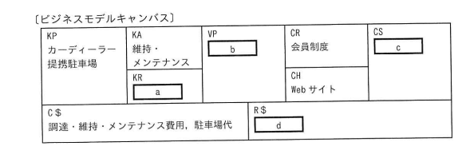

## 問題文

カーシェアビジネスをビジネスモデルキャンバスに当てはめた。bに該当するものはどれか。なお，ア～エはa～dのいずれかに該当する。

〔カーシェアビジネス〕
・カーディーラーから車両を調達し，維持・メンテナンスしながら，その車両を提携駐車場に保管・準備する。
・必要なときだけ車両を使いたい人が登録する会員制度を構築し，会員から月会費を徴収する。
・会員向けのWebサイトで，会員に使いたい車両や利用時間などを予約してもらい，会員に対して車両の時間貸しを行い，利用料を徴収する。

〔ビジネスモデルキャンバス〕

| KP（パートナー） カーディーラー・提携駐車場 | KA（主要活動） 維持・メンテナンス | VP（価値提案） **b** | CR（顧客との関係） 会員制度 |
|:--|:--|:--|:--|
| | KR（リソース） **a** | | CS（顧客セグメント） **c** |
| | | | CH（チャネル） Webサイト |

C$（コスト構造）：調達・維持・メンテナンス費用，駐車場代　　R$（収益の流れ）：**d**

ア　月会費，利用料　　イ　車両
ウ　車両の時間貸し　　エ　必要なときだけ車両を使いたい人

## 参照画像

<!-- 画像がある場合:  -->

## 正解

**ウ**：車両の時間貸し

## 選択肢補足

ビジネスモデルキャンバスの各空欄（a〜d）は，問題文の3つの記述から次のように対応づけられる。

| 空欄 | 対応するブロック | 該当する記述・内容 |
|:--|:--|:--|
| a | KR（リソース） | 「カーディーラーから車両を調達し」より，事業に必要な主要リソースは**車両（イ）** |
| **b** | **VP（価値提案）** | **「会員に対して車両の時間貸しを行い，利用料を徴収する」より，顧客に提供する価値は車両の時間貸し（ウ）** |
| c | CS（顧客セグメント） | 「必要なときだけ車両を使いたい人が登録する会員制度」より，対象とする顧客層は**必要なときだけ車両を使いたい人（エ）** |
| d | R$（収益の流れ） | 「会員から月会費を徴収する」「利用料を徴収する」より，収益の流れは**月会費，利用料（ア）** |

| 選択肢 | 内容 | 補足 |
|:--|:--|:--|
| ア | 月会費，利用料 | これは収益の流れ（R$）に対応する内容であり，dに該当する |
| イ | 車両 | これは事業運営に必要なリソース（KR）に対応する内容であり，aに該当する |
| **ウ** | **車両の時間貸し** | **正解。会員に対して提供される中心的な価値（顧客が対価を支払う対象となるサービス内容）であり，価値提案（VP）に対応する。bに該当する** |
| エ | 必要なときだけ車両を使いたい人 | これは事業のターゲットとなる顧客層（CS）に対応する内容であり，cに該当する |

## 解き方

1. 問題文のキーワードを整理する。
   - カーシェアビジネスの説明文を，ビジネスモデルキャンバスの9つのブロック（KP，KA，KR，VP，CR，CS，CH，C$，R$）に分解して当てはめ，空欄bに該当する語句を特定する問題である。
2. ビジネスモデルキャンバスの各ブロックの定義を確認する。
   - VP（Value Propositions：価値提案）：「顧客にどのような価値を提供するか」を表すブロックであり，顧客が対価を支払う対象となる中心的なサービス・製品の内容を記述する。
   - KR（Key Resources：リソース）：事業を成立させるために必要な主要資源（人材，設備，車両など）。
   - CS（Customer Segments：顧客セグメント）：価値を提供する対象となる顧客層。
   - R$（Revenue Streams：収益の流れ）：顧客からどのように対価を得るか（収益源）。
3. 表における各空欄の位置（どのブロックに該当するか）を確認する。
   - 表の配置から，a＝KR（リソース），b＝VP（価値提案），c＝CS（顧客セグメント），d＝R$（収益の流れ）に対応していることがわかる。
4. 問題文の3つの記述を，それぞれ対応するブロックの内容に当てはめる。
   - 「カーディーラーから車両を調達し，維持・メンテナンスしながら，提携駐車場に保管・準備する」→ KPはカーディーラー・提携駐車場，KAは維持・メンテナンス，そして事業運営の核となるリソースは「車両」（a）。
   - 「必要なときだけ車両を使いたい人が登録する会員制度を構築し，会員から月会費を徴収する」→ CRは会員制度，CSは「必要なときだけ車両を使いたい人」（c）。
   - 「会員向けのWebサイトで予約してもらい，会員に対して車両の時間貸しを行い，利用料を徴収する」→ CHはWebサイト，R$は「月会費，利用料」（d），そして顧客に提供する中心的な価値（VP）は「車両の時間貸し」（b）。
5. bに対応するブロックがVP（価値提案）であり，「会員に対して車両の時間貸しを行う」という記述がその内容と一致することから，**ウ（車両の時間貸し）**を正解と判断する。
